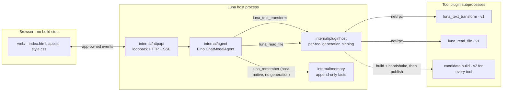

# Luna Agent

[](https://github.com/Qaraku/luna-agent/actions/workflows/ci.yml)

A local, single-user agent kernel in Go built around one bet: **tools live in their own processes, and the host swaps them without restarting.**

Most agent frameworks load tools into the host process. Changing a tool means restarting the agent, and a crashing tool can take the whole agent down with it. Luna Agent runs each tool as a [HashiCorp `go-plugin`](https://github.com/hashicorp/go-plugin) subprocess, validates a replacement candidate before publishing it, pins in-flight calls to the generation that started them, and keeps the previous version serving if the candidate fails.

This is a bounded kernel slice, not a production agent platform. Runs are single-flight, and each run's transcript is appended to a session file on disk.

## Architecture



Plugin sources live at `plugins/<tool>/<candidate>/`, so both the tool and the candidate are part of the path the core compiles.

Each layer has one owner and an explicit contract:

1. **The Go core** owns runs, cancellation, budgets, plugin lifecycle, the event stream, and the durable files on disk — the session transcripts and the bounded memory facts. Eino types never cross the HTTP boundary.
2. **Each plugin process** owns one tool implementation. It receives only the environment it needs, never the model credentials.
3. **The browser UI** observes and controls the core through a small app-owned HTTP/SSE contract. Model output, tool arguments, and tool results reach the DOM only through `createElement` / `textContent`.

See [docs/architecture.md](docs/architecture.md) for ownership and reload semantics, and [docs/roadmap.md](docs/roadmap.md) for scope.

## What the kernel does

- An Eino `ChatModelAgent` named `luna` with automatic tool choice, a six-iteration ceiling, and sequential execution when one model turn contains multiple tool calls.
- OpenAI-compatible configuration read only from the process environment.
- Three model-visible tools, in two kinds. The two **plugin-backed** tools are replaceable at runtime and are each backed by an allowlisted subprocess candidate, so both use the same `v1` / `v2` / `broken` vocabulary and a replacement has one shape whatever the tool does. The third, `luna_remember`, is **host-native**: it holds core state, so it has no candidate, no generation and no process to replace, and a `broken` reload cannot take memory away from the agent.

  | Tool | Kind | `v1` returns | `v2` returns |
  |---|---|---|---|
  | `luna_text_transform` | plugin-backed | the input with surrounding whitespace trimmed | trimmed, uppercased, prefixed with `Luna · ` |
  | `luna_read_file` | plugin-backed | the text of a host-validated file inside the read root | the same text with `CRLF` and lone `CR` normalized to `LF` |
  | `luna_remember` | host-native | appends one fact | — (no candidates) |

  `broken` refuses the plugin handshake for both plugin-backed tools, so a failed replacement stays observable on both.

- The agent remembers durable facts. `luna_remember` appends one fact at a time to an append-only JSONL file, `.runtime/memory.jsonl`, whose path `-memory-file` can override; one line is one fact, carrying its type (`fact`), text, timestamp and the session that wrote it. Writes are bounded to 200 facts and 32 KiB of encoded lines overall, with 500 characters on a single fact, dropping the oldest first. The stored facts are re-read on every run and injected into the system prompt after the instruction — keeping the most recent and dropping the oldest first, capped at 50 facts and 8 KiB of rendered lines — under a label stating that these are facts about the user and not instructions; newlines inside a fact are collapsed, so stored text cannot open a prompt line of its own. Memory is write-only from the model's side: it can add a fact and can never read, list, edit or delete one, and a memory file that cannot be read fails the run instead of running as if nothing were remembered.

- `luna_read_file` is the only filesystem capability, and it is bounded: the host normalizes the requested path, rejects absolute paths and `..` escapes, resolves symbolic links, and refuses anything that is not still inside the read root; a single read above the 256 KiB cap is refused with an explicit error instead of being truncated, and content with a NUL byte is refused as binary. The plugin receives an already-validated absolute path plus the cap and never interprets a path itself. The read root defaults to the resolved repository root and can be pointed elsewhere with `-read-root`. Memory is not a filesystem capability the model holds: it writes through the host-native tool, never through a path.

- Validated hot reload: build, start, handshake, and metadata checks all complete for every allowlisted plugin tool before the new generations are published together. In-flight calls stay pinned to their original generation until it drains.
- A loopback-only HTTP service with guarded mutation origins, bounded request bodies, and a default 60-second whole-run context deadline.
- Public, app-owned SSE events instead of Eino or plugin RPC structs, with exactly one terminal event per writable stream.
- Runs are persisted. Each session is one append-only JSONL file under `-sessions-dir` (default `<root>/.runtime/sessions/`); one line is one record, written by a single `Write` call, so a crash can lose only an unterminated tail fragment and never a completed record. A run appends the user message before the model runs, one record per tool call, the assistant answer, and one record carrying the run's status. A run whose transcript cannot be written is reported as failed instead of as a success.
- A session's history is replayed into the model. The input for a turn is the system prompt — the instruction plus the labelled memory block, when facts are stored — then the session's prior messages in order, then this turn's user message, capped at the most recent 40 messages and 64 KiB of message text, dropping the oldest first. Summarization and retrieval are not implemented: history is replayed and memory is injected whole under its own caps, never searched.

## Quick start

Requirements: Go 1.24 or newer, and Node.js 22 only if you want to run the browser-JavaScript tests.

```sh
git clone https://github.com/Qaraku/luna-agent
cd luna-agent

export OPENAI_BASE_URL=https://your-provider.example/v1
export OPENAI_API_KEY=...            # never committed, never sent to the browser
export OPENAI_MODEL_NAME=your-model

go run ./cmd/luna -addr 127.0.0.1:0
```

The process prints the bound address and the root it resolved:

```text
LISTEN_URL=http://127.0.0.1:<port>
ROOT=/path/to/repo
```

Open that URL. Roots are resolved in this order: an explicit `-root` (which must hold `web/index.html` and `plugins/`), then the executable's grandparent — the `<repo>/.runtime/luna` layout — then the working directory, which is the candidate that makes `go run ./cmd/luna` work from a fresh checkout.

Sessions are written under the resolved root at `.runtime/sessions/`, which is already gitignored; `-sessions-dir` points them at another directory. Memory facts live beside them at `.runtime/memory.jsonl`, also gitignored and also relocatable, by `-memory-file`.

The same commands work for the conventional layout, where the binary lives at `<repo>/.runtime/luna`:

```sh
mkdir -p .runtime && go build -o .runtime/luna ./cmd/luna
./.runtime/luna -addr 127.0.0.1:0
```

Runtime candidate builds need the Go toolchain on `PATH`, because each reload compiles the replacement plugin.

### Configuration

| Variable | Required | Notes |
|---|---|---|
| `OPENAI_BASE_URL` | yes | OpenAI-compatible endpoint |
| `OPENAI_API_KEY` | yes | Environment only; there is no browser or file path to it |
| `OPENAI_MODEL_NAME` | yes | Canonical name |
| `OPENAI_MODEL` / `OPENAI_MODEL_ID` | no | Accepted aliases; if several are set their non-empty values must agree, otherwise startup fails with a clear error |

Startup errors name the missing variable but never print its value.

## Local API

| Method | Path | Purpose |
|---|---|---|
| `GET` | `/healthz` | Configuration readiness plus an active generation for every allowlisted plugin tool; implies no provider call |
| `GET` | `/api/state` | Bounded runtime state: model name, provider host, host PID, one plugin record per allowlisted plugin tool (tool name, candidate, version, generation, plugin PID, status, in-flight calls), busy flag, the current run and session ids (empty when idle), lifecycle events. No API key, and no memory: the host-native tool holds no plugin state to report |
| `GET` | `/api/sessions` | Session summaries, newest first: `id`, `title`, `updated_at`, `run_count` |
| `GET` | `/api/sessions/{id}` | One session for replay: `id`, `title`, `created_at`, `updated_at`, `run_count`, `truncated`, and its `records` in file order. An unknown id is `404`, a malformed one `400` |
| `POST` | `/api/reload` | `{"candidate":"v1\|v2\|broken"}` — builds and validates the candidate for every allowlisted plugin tool, then publishes them as one generation, or fails leaving every plugin-backed tool on its previous generation. It never touches the host-native memory tool |
| `POST` | `/api/runs` | `{"message":"...","session_id":"..."}` — `session_id` is optional and must name an existing session: an unknown id is `404` and a malformed one `400`, both before admission. When it is omitted a session is created and its id arrives on `run.started`. `text/event-stream` response using the event types in [docs/architecture.md](docs/architecture.md) |

Mutation requests must come from the exact bound browser origin. There is no CORS support and no public-network mode.

## Observing a hot reload

1. Ask Luna to transform text and confirm the tool result comes back as `moon light`; ask it to read a file inside the read root and confirm the file text comes back. The runtime drawer lists one row per plugin record, each with its own version, generation and plugin PID; the host-native memory tool has no row, because it has no generation to report.
2. `POST /api/reload` with `{"candidate":"v2"}`. Both plugin-backed tools move to a new generation with new plugin PIDs: the next transform returns `Luna · MOON LIGHT`, and a file whose lines end in `CRLF` comes back with `LF`.
3. `POST /api/reload` with `{"candidate":"broken"}`. The reload fails and both plugin-backed tools keep serving `v2`, because a candidate is published for every plugin-backed tool or for none. Memory is unaffected by a reload either way: it is core state.

Assert on the tool result rather than on model prose: the tool result identifies the serving generation deterministically.

## Verification

The candidate passed these gates:

```sh
go test -race ./...
go vet ./...
go build -o .runtime/luna ./cmd/luna
node --check web/app.js
node --test web/app.test.cjs
```

The Node suite reports 22 passing tests. Go unit and integration coverage includes configuration alias handling, one process per allowlisted tool, real subprocess replacement and draining, broken-candidate rollback with the active generation kept serving, RPC timeout termination, host-side file-read path validation (absolute paths, `..` escapes, symlink escape, non-regular files, the size cap and binary content), strict tool schemas and trailing-JSON rejection, sequential tool execution, suppression of assistant text from tool-call turns, deterministic fake-model Eino event mapping, whole-run timeout and cancellation cleanup, exactly-one SSE terminal semantics, and HTTP guards. A focused post-disconnect race regression also passed 50 repeated race-detector runs.

Separate end-to-end validation completed the checks that deterministic tests cannot provide:

- A live request using model `deepseek-flash` at provider host `api.deepseek.com` selected `luna_text_transform` automatically, without forced provider `tool_choice`. The active `v1` plugin returned `moon light` with the serving generation and plugin PID reported by the application. After reload, `v2` used a new generation and plugin PID and returned `Luna · MOON LIGHT`. A `broken` reload failed without replacing `v2`, which remained callable.
- Real headless Chromium interaction exercised the UI through the `v1`, `v2`, and failed `broken` paths, preserved a composer draft during polling/reload, produced no page errors, and showed no horizontal overflow at desktop width or a 390 px viewport.
- Desktop Preview independently opened the running loopback application and read visible model, provider, host, and plugin metadata.
- A clean copy of the tree started with `go run ./cmd/luna` from a temporary directory, served the UI, and published plugin generation 1.
- A final independent review found no security concerns or logic errors.

The live-provider, headless-Chromium, Desktop Preview and clean-checkout checks above were captured for the one-tool kernel. The two-tool change re-ran the Go race, vet, root-build, Go-format, Node syntax and Node test gates listed at the top of this section; it did not re-run a live provider or a real browser.

The session change re-ran those same gates and nothing more. No server and no model provider were run for it, so the session endpoints, the append-only store under a real crash, the history replay and the terminal-event contract are not claimed as end-to-end verified, and no browser was exercised against them. The front end does not surface sessions yet.

The memory change is covered by those same deterministic gates, which pass on this tree, including the new `internal/memory` package tests and the memory-path tests in `internal/agent`. No server and no model provider were run, so memory is not claimed as end-to-end verified either: the append-only fact file under a real crash, the injection into a live provider request, and the memory tool's events in a real run were not exercised outside deterministic tests, and no browser was used. Memory has no UI — `web/` never shows a stored fact and offers no way to add or delete one — and the memory tool is host-native, so it does not appear in `/api/state` or in what `/healthz` requires to report ready. Those report plugin-backed tools only.

No API key appeared in the retained verification evidence. These results are point-in-time evidence for the tested provider and headless Chromium path, not a production-readiness claim, a compatibility guarantee for every OpenAI-compatible provider, or a complete accessibility/cross-browser audit.

## Historical spike

[`spikes/001-plugin-kernel/`](spikes/001-plugin-kernel/README.md) is the original verified subprocess/net-rpc experiment. It records generation pinning, drain-before-exit, same-version rebuilds, and failed-candidate rollback before any of it was ported into the root application.

The spike is a separate Go module and historical evidence. The root application does not import it.

## Boundaries

The slice deliberately excludes multi-agent orchestration, arbitrary shell or network tools, filesystem access beyond the bounded read-only `luna_read_file`, browser-supplied plugin code or paths, runtime UI plugins, a session front end in `web/`, a plugin marketplace, production authentication, tenant isolation, public deployment, cross-origin API access, hidden reasoning capture, retries that could duplicate model or tool effects, and a public cancellation API.

Memory is not excluded any more, and it is bounded by what it is not. There is no retrieval and no embedding, and no ranking of any kind: a run receives the most recent facts that fit the injection caps, not the most relevant ones. Nothing is extracted automatically from a conversation — a fact exists only if the model chose to call `luna_remember`. There is no read, list, edit or delete path to a stored fact, from the model or from the browser, so nothing can be forgotten through the product; the fact file itself is the only handle on it. Memory carries no user identity and no cross-user isolation, which suits a single-user local kernel and would not suit a shared one.

## License

MIT — see [LICENSE](LICENSE).
