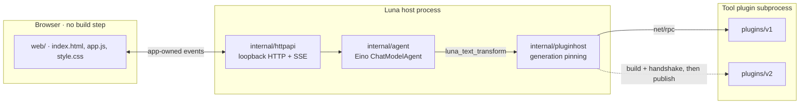

# Luna Agent

[](https://github.com/Qaraku/luna-agent/actions/workflows/ci.yml)

A local, single-user agent kernel in Go built around one bet: **tools live in their own processes, and the host swaps them without restarting.**

Most agent frameworks load tools into the host process. Changing a tool means restarting the agent, and a crashing tool can take the whole agent down with it. Luna Agent runs each tool as a [HashiCorp `go-plugin`](https://github.com/hashicorp/go-plugin) subprocess, validates a replacement candidate before publishing it, pins in-flight calls to the generation that started them, and keeps the previous version serving if the candidate fails.

This is a bounded kernel slice, not a production agent platform. Runs are single-flight and are not persisted.

## Architecture



Each layer has one owner and an explicit contract:

1. **The Go core** owns runs, cancellation, budgets, plugin lifecycle, and the event stream. Eino types never cross the HTTP boundary.
2. **The plugin process** owns one tool implementation. It receives only the environment it needs, never the model credentials.
3. **The browser UI** observes and controls the core through a small app-owned HTTP/SSE contract. Model output, tool arguments, and tool results reach the DOM only through `createElement` / `textContent`.

See [docs/architecture.md](docs/architecture.md) for ownership and reload semantics, and [docs/roadmap.md](docs/roadmap.md) for scope.

## What the kernel does

- An Eino `ChatModelAgent` named `luna` with automatic tool choice, a six-iteration ceiling, and sequential execution when one model turn contains multiple tool calls.
- OpenAI-compatible configuration read only from the process environment.
- One model-visible tool, `luna_text_transform`, backed by an allowlisted subprocess candidate:

  | Candidate | `Invoke` returns |
  |---|---|
  | `v1` | the input with surrounding whitespace trimmed |
  | `v2` | trimmed, uppercased, prefixed with `Luna · ` |
  | `broken` | refuses the plugin handshake, so rollback is observable |

- Validated hot reload: build, start, handshake, and metadata checks all complete before a new generation is published. In-flight calls stay pinned to their original generation until it drains.
- A loopback-only HTTP service with guarded mutation origins, bounded request bodies, and a default 60-second whole-run context deadline.
- Public, app-owned SSE events instead of Eino or plugin RPC structs, with exactly one terminal event per writable stream.

## Quick start

Requirements: Go 1.24 or newer, and Node.js 22 only if you want to run the browser-JavaScript tests.

```sh
git clone https://github.com/Qaraku/luna-agent
cd luna-agent

export OPENAI_BASE_URL=https://your-provider.example/v1
export OPENAI_API_KEY=...            # never committed, never sent to the browser
export OPENAI_MODEL_NAME=your-model

go run ./cmd/luna -addr 127.0.0.1:0
```

The process prints the bound address and the root it resolved:

```text
LISTEN_URL=http://127.0.0.1:<port>
ROOT=/path/to/repo
```

Open that URL. Roots are resolved in this order: an explicit `-root` (which must hold `web/index.html` and `plugins/`), then the executable's grandparent — the `<repo>/.runtime/luna` layout — then the working directory, which is the candidate that makes `go run ./cmd/luna` work from a fresh checkout.

The same commands work for the conventional layout, where the binary lives at `<repo>/.runtime/luna`:

```sh
mkdir -p .runtime && go build -o .runtime/luna ./cmd/luna
./.runtime/luna -addr 127.0.0.1:0
```

Runtime candidate builds need the Go toolchain on `PATH`, because each reload compiles the replacement plugin.

### Configuration

| Variable | Required | Notes |
|---|---|---|
| `OPENAI_BASE_URL` | yes | OpenAI-compatible endpoint |
| `OPENAI_API_KEY` | yes | Environment only; there is no browser or file path to it |
| `OPENAI_MODEL_NAME` | yes | Canonical name |
| `OPENAI_MODEL` / `OPENAI_MODEL_ID` | no | Accepted aliases; if several are set their non-empty values must agree, otherwise startup fails with a clear error |

Startup errors name the missing variable but never print its value.

## Local API

| Method | Path | Purpose |
|---|---|---|
| `GET` | `/healthz` | Configuration and plugin readiness; implies no provider call |
| `GET` | `/api/state` | Bounded runtime state: model name, provider host, host and plugin PIDs, generations, busy flag, lifecycle events. No API key |
| `POST` | `/api/reload` | `{"candidate":"v1\|v2\|broken"}` — validated replacement, or a rollback-preserving error |
| `POST` | `/api/runs` | `{"message":"..."}` — `text/event-stream` response using the event types in [docs/architecture.md](docs/architecture.md) |

Mutation requests must come from the exact bound browser origin. There is no CORS support and no public-network mode.

## Observing a hot reload

1. Send a message and confirm the tool result comes back as `moon light`.
2. `POST /api/reload` with `{"candidate":"v2"}`. The next run returns `Luna · MOON LIGHT` from a new generation and a new plugin PID.
3. `POST /api/reload` with `{"candidate":"broken"}`. The reload fails and `v2` keeps serving.

Assert on the tool result rather than on model prose: the tool result identifies the serving generation deterministically.

## Verification

The candidate passed these gates:

```sh
go test -race ./...
go vet ./...
go build -o .runtime/luna ./cmd/luna
node --check web/app.js
node --test web/app.test.cjs
```

The Node suite reports 8 passing tests. Go unit and integration coverage includes configuration alias handling, real subprocess replacement and draining, broken-candidate rollback, RPC timeout termination, strict tool schema and trailing-JSON rejection, sequential tool execution, suppression of assistant text from tool-call turns, deterministic fake-model Eino event mapping, whole-run timeout and cancellation cleanup, exactly-one SSE terminal semantics, and HTTP guards. A focused post-disconnect race regression also passed 50 repeated race-detector runs.

Separate end-to-end validation completed the checks that deterministic tests cannot provide:

- A live request using model `deepseek-flash` at provider host `api.deepseek.com` selected `luna_text_transform` automatically, without forced provider `tool_choice`. The active `v1` plugin returned `moon light` with the serving generation and plugin PID reported by the application. After reload, `v2` used a new generation and plugin PID and returned `Luna · MOON LIGHT`. A `broken` reload failed without replacing `v2`, which remained callable.
- Real headless Chromium interaction exercised the UI through the `v1`, `v2`, and failed `broken` paths, preserved a composer draft during polling/reload, produced no page errors, and showed no horizontal overflow at desktop width or a 390 px viewport.
- Desktop Preview independently opened the running loopback application and read visible model, provider, host, and plugin metadata.
- A clean copy of the tree started with `go run ./cmd/luna` from a temporary directory, served the UI, and published plugin generation 1.
- A final independent review found no security concerns or logic errors.

No API key appeared in the retained verification evidence. These results are point-in-time evidence for the tested provider and headless Chromium path, not a production-readiness claim, a compatibility guarantee for every OpenAI-compatible provider, or a complete accessibility/cross-browser audit.

## Historical spike

[`spikes/001-plugin-kernel/`](spikes/001-plugin-kernel/README.md) is the original verified subprocess/net-rpc experiment. It records generation pinning, drain-before-exit, same-version rebuilds, and failed-candidate rollback before any of it was ported into the root application.

The spike is a separate Go module and historical evidence. The root application does not import it.

## Boundaries

The slice deliberately excludes multi-agent orchestration, persistent conversations, durable run history, long-term memory, arbitrary shell/filesystem/network tools, browser-supplied plugin code or paths, runtime UI plugins, a plugin marketplace, production authentication, tenant isolation, public deployment, cross-origin API access, hidden reasoning capture, retries that could duplicate model or tool effects, and a public cancellation API.

## License

MIT — see [LICENSE](LICENSE).
