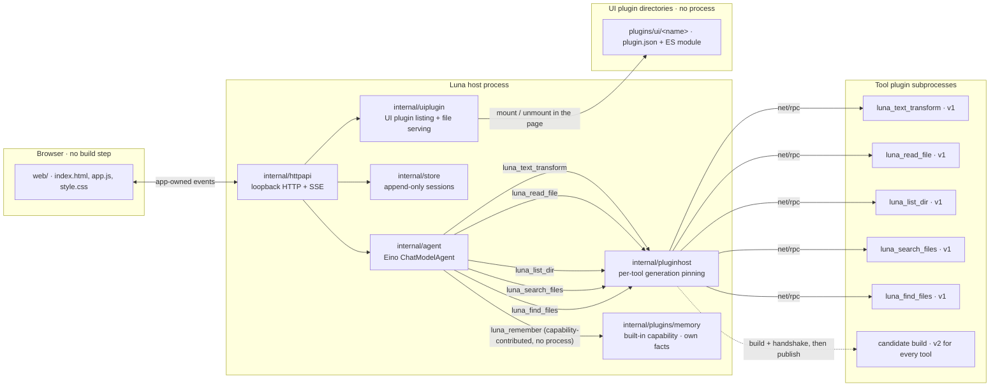

# Luna Agent

[](https://github.com/Qaraku/luna-agent/actions/workflows/ci.yml)

A local, single-user agent kernel in Go built around one bet: **tools live in their own processes, and the host swaps them without restarting.**

Most agent frameworks load tools into the host process. Changing a tool means restarting the agent, and a crashing tool can take the whole agent down with it. Luna Agent runs each tool as a [HashiCorp `go-plugin`](https://github.com/hashicorp/go-plugin) subprocess, validates a replacement candidate before publishing it, pins in-flight calls to the generation that started them, and keeps the previous version serving if the candidate fails.

This is a bounded kernel slice, not a production agent platform. Runs are single-flight, and each run's transcript is appended to a session file on disk.

## Architecture


```mermaid
flowchart LR
    subgraph Browser["Browser · no build step"]
        UI["web/ · index.html, app.js, style.css"]
    end

    subgraph Host["Luna host process"]
        API["internal/httpapi<br/>loopback HTTP + SSE"]
        Agent["internal/agent<br/>Eino ChatModelAgent"]
        PH["internal/pluginhost<br/>per-tool generation pinning"]
        Mem["internal/plugins/memory<br/>built-in capability · own facts"]
        Store["internal/store<br/>append-only sessions"]
        UIP["internal/uiplugin<br/>UI plugin listing + file serving"]
    end

    subgraph Plugins["Tool plugin subprocesses"]
        T1["luna_text_transform · v1"]
        R1["luna_read_file · v1"]
        D1["luna_list_dir · v1"]
        S1["luna_search_files · v1"]
        F1["luna_find_files · v1"]
        C["candidate build · v2 for every tool"]
    end

    subgraph UIPlugins["UI plugin directories · no process"]
        UIPlug["plugins/ui/&lt;name&gt; · plugin.json + ES module"]
    end

    UI <-->|"app-owned events"| API
    API --> Agent
    API --> Store
    API --> UIP
    Agent -->|"luna_remember (capability-contributed, no process)"| Mem
    Agent -->|"luna_text_transform"| PH
    Agent -->|"luna_read_file"| PH
    Agent -->|"luna_list_dir"| PH
    Agent -->|"luna_search_files"| PH
    Agent -->|"luna_find_files"| PH
    PH -->|"net/rpc"| T1
    PH -->|"net/rpc"| R1
    PH -->|"net/rpc"| D1
    PH -->|"net/rpc"| S1
    PH -->|"net/rpc"| F1
    PH -.->|"build + handshake, then publish"| C
    UIP -->|"mount / unmount in the page"| UIPlug
```

Plugin sources live at `plugins/<tool>/<candidate>/`, so both the tool and the candidate are part of the path the core compiles.

Each layer has one owner and an explicit contract:

1. **The Go core** owns runs, cancellation, budgets, tool-subprocess lifecycle, the event stream, and the session transcripts on disk. The bounded memory facts are the Memory capability's own state, not something the core owns. Eino types never cross the HTTP boundary.
2. **Each plugin process** owns one tool implementation. It receives only the environment it needs, never the model credentials.
3. **The browser UI** observes and controls the core through a small app-owned HTTP/SSE contract. Model output, tool arguments, and tool results reach the DOM only through `createElement` / `textContent`. A UI plugin is code the core serves and the page runs in its own container, under the narrow `mount`/`unmount` API described below.

See [docs/architecture.md](docs/architecture.md) for ownership and reload semantics, and [docs/roadmap.md](docs/roadmap.md) for scope.

## 日常界面

- **会话**：桌面左侧会话列表和“新建会话”，可以一键折叠、也可以拖动右边缘调整宽度；折叠后页头左边出现展开入口。折叠状态和宽度只存在浏览器本地。窄屏仍然按抽屉处理，通过页头“会话”按钮打开列表，选中后回到对话。
- **设置**：侧栏底部的“设置”打开一个独立模态，左侧是分类导航（外观 / 模型服务 / 能力 / 技能 / 工作区 / 界面扩展 / 诊断），右侧是内容面，内部自己滚动；关闭后回到原来的会话上下文。凡是“Luna 有什么、在用什么”的入口都在这里。“能力”列出内核当前注册的能力——各自的部署形态、是否在服务、贡献了哪些工具与上下文块、哪些路由与面板，并可在这里启用或停用，以及直接打开某个能力贡献的面板；声明与权限属于开发者信息，收在每行下面默认折叠的次级块里。停用只是把这些从服务里取下并如实重绘，能力自己的数据不动。“模型服务”编辑这台机器的 provider 列表——每个 provider 的名字、接口地址、密钥、默认模型与其他模型，标出使用中的那一个，新增、编辑与删除都在这里，删除要二次确认；密钥只写不读，界面上只有“是否已设置 + 末四位”。同一页只读显示当前在用的模型、provider 与两个运行预算，并列出当前 provider 可用的模型、把当前会话切到其中一个；档位未设置时如实写作“未发送”，而不是补一个默认值。“工作区”列出本机定义过的工作区（一组目录），标出当前会话在用的那个并可以换；没有绑定时说清楚文件工具回到启动时的读取根。
- **工作目录与项目规则**：内置的 Workspace 能力向模型贡献两条上下文——这个会话在哪些目录里工作（只用目录名，不写宿主绝对路径），以及这些目录自己的规则。**一个 Workspace 是一个或多个目录的集合**（例如同时包含 `luna-agent` 和 `luna-agent-dev`），会话与它关联；每个目录的 `AGENTS.md` 作为“规则”进入上下文（默认文件名，`-rules-file` 仍可覆盖单根回退时的取值）。文件不存在只意味着那个目录没有规则；超限或不可读会被报告而不是截断。**没有关联 Workspace 的会话走回退**，与旧行为一致（安装根/`-read-root` 的单根身份与规则），所以已有会话不会因为这次改动而变。`AGENTS.md` 的读取复用文件工具那套边界（`internal/fileread`，根就是那个目录），能力不新增权限声明。**Workspace 不是权限范围**：它是“在哪些目录里工作”，不是“允许读写什么”——权限是以后独立设计的另一件事。
- **记忆**：页头的“记忆”入口来自 Memory 能力贡献的面板——宿主按 `/api/state` 的 `capabilities[]` 渲染入口与容器，打开时加载能力自己的模块。面板的主体是生效中的事实（每条带来源与时间，可以就地撤回），已撤回的那些只占一行摘要，点开才列出：撤回记录是存储的事实，不是用户在主要界面上要看的一屏内容。不提供新增或编辑。
- **界面扩展**：本地界面插件的管理与内容展示在设置的“界面扩展”分类里，不再占用页头入口；启用状态仍然在刷新后重置。
- **外观**：在设置的“外观”分类里选择“跟随系统”“浅色”“深色”。切换只改根 token，不重建会话或插件；插件可复用宿主的语义颜色、字体和基础控件样式。
- **运行详情**：页头的这个抽屉只说这一次运行用什么、还有多少余地——模型、提供方、思考档位、两个运行预算、会话状态与运行中的会话。**开发与排查用的东西不在它里面**：工具插件的代次与进程、候选版本的验证与替换、生命周期事件都在设置的“诊断”分类里，页头不再有第二个内置开关（能力贡献的面板入口与窄屏的会话抽屉不在此列）。

会话列表的标题单行省略，右侧的相对时间固定不收缩，因此侧栏只纵向滚动；折叠状态、宽度和主题是浏览器本地保存的三项界面偏好。

界面插件与主页面同源运行，受限的宿主接口不是安全沙箱。只启用可信的本地插件；主题与样式契约见 [架构说明](docs/architecture.md#界面主题与插件样式)。

## What the kernel does

- An Eino `ChatModelAgent` named `luna` with automatic tool choice, a 64-turn model ceiling (`max_iterations`), and sequential execution when one model turn contains multiple tool calls.
- OpenAI-compatible configuration read from the process environment and, where the file states a value, from `$XDG_CONFIG_HOME/luna/config.yaml`; the file wins and the environment fills in the rest.
- Seven model-visible tools, in two kinds. The five **plugin-backed** tools are replaceable at runtime and are each backed by an allowlisted subprocess candidate, so all five use the same `v1` / `v2` / `broken` vocabulary and a replacement has one shape whatever the tool does. The other two are contributed by **built-in capabilities**: they are not subprocesses, so they have no candidate, no generation and no process to replace, their call events carry no process identity, and a `broken` reload cannot take them away from the agent. `luna_remember` belongs to Memory and `luna_skill_view` to Skills.

  | Tool | Kind | `v1` returns | `v2` returns |
  |---|---|---|---|
  | `luna_text_transform` | plugin-backed | the input with surrounding whitespace trimmed | trimmed, uppercased, prefixed with `Luna · ` |
  | `luna_read_file` | plugin-backed | the text of a host-validated file inside the read root, or of one line range of it | the same text with `CRLF` and lone `CR` normalized to `LF` |
  | `luna_list_dir` | plugin-backed | one level of a host-validated directory inside the read root: each entry with its kind, and a size for regular files | the same listing with every size as an exact byte count |
  | `luna_search_files` | plugin-backed | literal matches inside a host-validated directory in the read root, as `path:line: text` | the same matches with each line's leading indentation stripped |
  | `luna_find_files` | plugin-backed | the entries whose name matches a glob, at any depth below a host-validated directory in the read root, one line per match with its kind, a size for regular files and its path | the same matches with every size as an exact byte count |
  | `luna_remember` | capability-contributed | appends one fact | — (no candidates) |
  | `luna_skill_view` | capability-contributed | the body of one skill, or of one file inside that skill's own directory | — (no candidates) |

  `broken` refuses the plugin handshake for every plugin-backed tool, so a failed replacement stays observable on all five.

- The agent remembers durable facts, and that is a capability's business rather than the kernel's. `luna_remember` is contributed by the built-in Memory capability, which owns its own store and its own rules; the file is still an append-only JSONL `.runtime/memory.jsonl` by default — one line is one fact, carrying its type (`fact`), text, timestamp and the session that wrote it — and the file name inside its state directory is the capability's own choice, not a kernel setting. `-state-dir` moves the state root the capability keeps that directory under (default: the user's data root when nothing is there yet; a checkout that still holds `.runtime/memory.jsonl` keeps writing there, so existing data needs no migration and nothing is moved); there is no `-memory-file` flag any more. Writes are bounded to 200 facts and 32 KiB of encoded lines overall, with 500 characters on a single fact, dropping the oldest first — every complete line counts, retractions included, so retracting in a loop cannot grow the file. The stored facts are re-read on every run and injected as one context block the capability contributes: the kernel labels it as reference data rather than instructions and truncates on line boundaries inside the block's budget, and the capability keeps the most recent facts, capped at 50 facts and 8 KiB of rendered lines; newlines inside a fact are collapsed, so stored text cannot open a prompt line of its own. Memory is write-only from the model's side: it can add a fact and can never read, list, edit or delete one, and a memory file that cannot be read fails the run instead of running as if nothing were remembered.

- 用户通过 Memory 能力贡献的面板查看和撤回事实；`GET /api/memory` 与 `POST /api/memory/retract` 也是这个能力贡献的接口，内核只负责挂载与守卫。`GET /api/memory` 列出生效与已撤回的事实；`POST /api/memory/retract` 按文本和时间戳共同匹配目标。撤回只追加记录，不就地修改事实；读取和上下文注入时排除被撤回的事实。字节上限计算所有记录，压缩重写时一起移除事实及对应撤回记录，避免反复撤回导致文件无限增长。模型权限不变，仍没有读取、列出、编辑或撤回工具。

- Skills are directories of instructions the model can consult, contributed by the built-in Skills capability. A skill is a directory under a skills root — `$XDG_DATA_HOME/luna/skills` by default, plus any `-skills-dir` — holding a `SKILL.md` whose YAML frontmatter names it (`name` must equal the directory name) and describes it (`description`, up to 1024 characters). Discovery reads only the frontmatter and contributes the resulting list as one context block, which the kernel labels as procedural knowledge rather than as reference data or as project rules; the body is not loaded until the model asks for it, which is what keeps a library of skills from filling the prompt. `luna_skill_view` returns either the `SKILL.md` body (frontmatter stripped) or one file inside that skill's own directory, and it reuses the file tools' boundary with the skill's directory as its root: a path that leaves the skill is refused before anything is read, and over-limit or binary content is refused rather than truncated. A skill file larger than 256 KiB is reported as a problem instead of being read, an unknown frontmatter field is ignored — a skill is third-party content, and one field from a newer tool should not make it unusable — and two skills with the same name resolve by scope (`builtin` < `user` < `project`), with the shadowed one reported rather than dropped. Turning a skill off is a user choice rather than a state change of the capability, so it is stored in `$XDG_CONFIG_HOME/luna/settings.yaml` — a file Luna writes, unlike `config.yaml`, which is the user's to edit — and it takes effect on the next run: an off skill is out of the manifest and `luna_skill_view` refuses it by saying it is turned off, not that it does not exist.

- The model's filesystem capability is read-only and bounded, and the four file tools share one boundary. `luna_read_file` reads one file, `luna_list_dir` lists one directory, `luna_search_files` searches one directory for a literal and `luna_find_files` finds entries by name below one directory, and each takes a path relative to the directories the session works in — **the directories of the workspace the session is bound to, tried in order**; a session bound to none falls back to the single configured root, which is the behaviour every session had before workspaces existed. The host is the only place that path is interpreted: it normalizes it, rejects absolute paths and `..` escapes, resolves symbolic links, and refuses anything that is not still inside one of those directories — so neither a listing, a search nor a find can reach somewhere a read cannot, a path that escapes one directory is not rescued by a sibling, and an out-of-bounds path is refused before any plugin runs. A single read above the 256 KiB cap is refused with an explicit error instead of being truncated, and content with a NUL byte is refused as binary. A file too large to read whole is not a dead end: `start_line` (counting from 1) and `max_lines` read one range of it, scanned line by line rather than by reading the file and cutting it — which would defeat the very cap it is working around. The result says which lines it returned and how many were left unread, and a `start_line` past the last line is refused with the file's line count instead of returning nothing. A listing is deliberately one level deep and never recursive: a subdirectory appears as an entry and is not entered, each entry carries its kind (`dir`, `file`, `link`, `other`) and a size for regular files, directories come first and then files and links, each sorted by name, and one listing renders at most 200 entries in lines of at most 160 bytes — saying how many entries it left out instead of quietly returning a prefix. A search matches its query literally rather than as a pattern — a regular expression would turn "not found" into "backtracked until it timed out" — and is bounded by matched lines, line length, files read and one file's size, skipping binary content by the same NUL rule; reaching any of those bounds is reported with how much was left unsearched rather than returned as if it were the whole answer. A name search matches a glob (`*`, `?`, `[abc]`) against the whole entry name rather than testing a substring, so `main.go` matches only that file and `*_test.go` matches Go test files at any depth; it renders one line per match with the entry's kind, a size for regular files and its path relative to where the find started, marking a directory with a trailing slash so a match that is a directory cannot be mistaken for a file, and it never follows a symbolic link — a link is reported by its own name and never entered. It is bounded by rendered paths, line length and entries examined, and it states the cap it reached and that the remaining entries were not examined instead of reporting a prefix as the whole tree. An empty pattern, a pattern aimed at a path and a pattern that is not a valid glob are refused before any directory is read. The plugin receives an already-validated absolute path plus the caps and never interprets a path itself. The fallback root defaults to the resolved repository root and can be pointed elsewhere with `-read-root`. Memory is not a filesystem capability the model holds either: it writes through the tool its capability contributes, never through a path.

- Validated hot reload: build, start, handshake, and metadata checks all complete for every allowlisted plugin tool before the new generations are published together. In-flight calls stay pinned to their original generation until it drains.
- A loopback-only HTTP service with guarded mutation origins, bounded request bodies, and a default 15-minute whole-run deadline (`run_timeout`).
- Public, app-owned SSE events instead of Eino or plugin RPC structs, with exactly one terminal event per writable stream.
- Runs are persisted. Each session is one append-only JSONL file under `-sessions-dir` (default `<data>/sessions` — the user's data root; a checkout that already holds sessions in the previous `<root>/.runtime/sessions/` keeps using that location, and startup says which one it chose); one line is one record, written by a single `Write` call, so a crash can lose only an unterminated tail fragment and never a completed record. A run appends the user message before the model runs, one record per tool call, the assistant answer, and one record carrying the run's status. A run whose transcript cannot be written is reported as failed instead of as a success.
- A session's history is replayed into the model. The input for a turn is the system prompt — the instruction plus the context blocks the enabled capabilities contribute, each labelled by the kernel as reference data rather than instructions and truncated on line boundaries inside its own budget — then the session's prior messages in order, then this turn's user message, capped at the most recent 40 messages and 64 KiB of message text, dropping the oldest first. Summarization and retrieval are not implemented: history is replayed and memory is injected whole under its own caps, never searched.

- The browser surface is extensible at runtime. A UI plugin is a directory `plugins/ui/<name>/` holding `plugin.json` and an ES module exporting `mount(target, api)` and `unmount(target)`; the host hands `mount` a container element and a narrow API (a log callback and the host version), lists what it found over `GET /api/ui-plugins` while reporting the directories it skipped and why, and serves each plugin's files from inside that plugin's own directory under the same containment validator the file tool uses. `unmount` owns the plugin's listeners and timers, but the host removes the container even when `unmount` throws, and reports it, so no half-mounted state survives. Enable state is deliberately not persisted: after a refresh every plugin is off.

- A tool call can fail in two ways, and only one of them ends the run. A **refusal** — a rejected path, the file-read size cap, binary content, a malformed argument — is reported to the UI as `tool.failed` and handed to the model as the call's result, so the run continues and the model explains the reason in the user's language. An **infrastructure** failure — no active plugin, an RPC timeout or cancellation that terminated the plugin, a plugin process that is gone — is raised as an error and ends the run as `run.failed`, because a model cannot be told anything useful about a plugin that is not there.

- A **capability** is the product surface; the kernel only runs it. One capability declares what it contributes — tools, context blocks, HTTP routes, browser panels — together with its resource claims (route prefix, panel id, state namespace) and the permissions it needs, and it has a lifecycle state (`registered` / `enabled` / `disabled` / `failed`). Registration rejects a name another capability already claimed, an exposure the descriptor did not declare, and a permission the kernel does not grant, so a descriptor cannot lie about what it does. `GET /api/state` reports every registered capability under `capabilities[]` (`id`, `title`, `deployment`, `state`, `contributions`, `claims`, `permissions`, `panels`) and carries none of the data that capability keeps. `POST /api/plugins/{id}/enable|disable` changes that state: disabling takes the capability's tools, context block, routes and panels out of service together and never deletes its data — removing data is a separate, explicit operation — and a transition the current state does not allow is `409`. Three capabilities are assembled this way — Memory, Workspace and Skills — and being built in is a deployment choice, not a privilege. A capability's tools leave the model's tool set on the next run after it is disabled: the agent is rebuilt when the list it was built from is no longer current.

## Quick start

Requirements: Go 1.24 or newer, and Node.js 22 only if you want to run the browser-JavaScript tests.

```sh
git clone https://github.com/Qaraku/luna-agent
cd luna-agent

go run ./cmd/luna -addr 127.0.0.1:0
```

The process prints the bound address and the root it resolved:

```text
LISTEN_URL=http://127.0.0.1:<port>
ROOT=/path/to/repo
```

Open that URL, then open **Settings → 模型服务**. One row per provider there: a
name, an endpoint, an API key and the models that endpoint serves, with the one in
use marked. Luna writes the list to its own `provider.yaml` in the configuration
directory, so a first run works with nothing configured: the page that configures
it is served by the same process.

A second provider is another row, and choosing which one to use is one click on
the row; the next message uses it. Nothing is restarted for that: the provider is
read when a run starts, not when the process does. The page can also ask the
endpoint which models it serves (`获取模型列表`), and it offers them as the model to
use while still accepting a name typed by hand.

Roots are resolved in this order: an explicit `-root` (which must hold `web/index.html` and `plugins/`), then the executable's grandparent — the `<repo>/.runtime/luna` layout — then the working directory, which is the candidate that makes `go run ./cmd/luna` work from a fresh checkout.

Sessions are written under the user's data root at `sessions/`; `-sessions-dir` points them at another directory. A checkout whose sessions still live in `.runtime/sessions/` keeps using that location, so an existing installation never moves on its own — startup logs one line per decision saying which location is in use, and where the data would live after a move. Memory facts live in the Memory capability's state root at `.runtime/memory.jsonl` — the namespace is the capability's own claim and the file name is its own choice, not a kernel setting — and that root defaults to the data root, or stays at `.runtime/memory.jsonl` under the resolved root when the file is already there. `-state-dir` moves the state root.

The same commands work for the conventional layout, where the binary lives at `<repo>/.runtime/luna`:

```sh
mkdir -p .runtime && go build -o .runtime/luna ./cmd/luna
./.runtime/luna -addr 127.0.0.1:0
```

Runtime candidate builds need the Go toolchain on `PATH`, because each reload compiles the replacement plugin.

### Configuration

Where Luna calls and with which key is a setting of the installation, not
something a launcher exports. It is stored in Luna's own file, written by the
settings page: a list of named providers, and which of them a run is sent to.

```yaml
# ~/.config/luna/provider.yaml   (0600; Luna writes this one)
active: deepseek                   # the provider a run is sent to
providers:
  deepseek:
    base_url: https://api.deepseek.com/v1
    api_key: sk-...                # written by the settings page, never returned to the browser
    model: deepseek-chat           # what a run asks for by default
    models:                        # the others /model can switch to
      - deepseek-reasoner
  local:
    base_url: http://127.0.0.1:11434/v1
    api_key: none
    model: qwen3
```

An empty provider list is a Luna that has not been configured yet; one provider
listed without `active` naming it (or an `active` that names nothing) is refused,
because a run would not know where to go.

A file an earlier version wrote — `base_url`, `api_key` and `model` at the top
level, before providers had names — is still read, as one provider named
`default`. An installation that was already configured keeps working, and the next
save writes the shape above.

Nothing about this file can stop Luna. A file that cannot be read is logged once
at startup, the process serves anyway, and the reason is what the settings page
shows, what `/api/state` reports and what a run fails with — exiting would put the
one surface that can repair the file out of reach. Either way the file is left as
it is; repairing it is the reader's decision, not a silent rewrite.

`config.yaml`, the file a person edits by hand, stays theirs: Luna reads it and
never rewrites it, comments included. It holds the two run budgets and the
reasoning level, and it cannot state an endpoint, a key or a model: two answers to
"which provider does this call" is one too many, and the settings page is where
that answer is written.

```yaml
# ~/.config/luna/config.yaml
reasoning_effort: high
max_iterations: 64            # how many model turns one run may take
run_timeout: 20m              # how long one run may take
```

A missing file is not an error, an empty file is an empty configuration, and an
unknown key is refused rather than ignored — a misspelled setting that does
nothing is worse than one that fails to load. Startup says which file it read.

A Luna with no provider at all is not an error either: it starts, says what is
unset, and serves the page that sets it. A run started meanwhile fails with a
sentence naming the missing settings rather than with a provider error — and once
the page saves a provider, that run works without a restart, because the file is
read when a run starts.

| Variable | Required | Notes |
|---|---|---|
| `LUNA_HOME` | no | One directory holding everything: configuration, sessions, capability state and cache. Setting it overrides every XDG root and every previous location, so a development checkout can keep its files next to itself (`LUNA_HOME=$PWD/.runtime`). A relative value is refused rather than ignored. Startup prints it |
| `LUNA_REASONING_EFFORT` | no | How hard the model should think before it answers, sent as the API's own `reasoning_effort`. One of `minimal`, `low`, `medium`, `high`, `none`. Unset means the field is not sent at all, so a provider that does not define it is unaffected. Whether a level changes anything is the provider's business: against `api.deepseek.com` it is accepted and makes no measurable difference |
| `LUNA_MAX_ITERATIONS` | no | How many model turns one run may take before it is stopped as a runaway loop (`max_iterations` in the file overrides it). A backstop, not a work budget: the default is 64 turns, which one turn may spend on several tool calls, and a task that needs more can be given more. Reaching it fails the run with a message naming the number and this variable |
| `LUNA_RUN_TIMEOUT` | no | How long one run may take, as a Go duration such as `20m` or `90s` (`run_timeout` in the file overrides it). Default `15m`. Reaching it ends the run as `run.cancelled` with the reason `timeout`, which is not a failure |

There is no environment variable for the endpoint, the key or the model: which
provider a Luna calls is a property of that installation, and one variable that
could silently override it would be a second answer to the same question.

Startup errors name the missing variable but never print its value.

## Local API

| Method | Path | Purpose |
|---|---|---|
| `GET` | `/healthz` | Configuration readiness plus an active generation for every allowlisted plugin tool; implies no provider call |
| `GET` | `/api/state` | Bounded runtime state: model name, provider host, host PID, one plugin record per allowlisted plugin tool (tool name, candidate, version, generation, plugin PID, status, in-flight calls), busy flag, the two run budgets it enforces (`max_iterations`, `run_timeout_ms`), the reasoning tier it was started with (omitted when none was chosen), the current run and session ids (empty when idle), `provider_missing` (what a run started now would still lack) and `provider_problem` (why the provider file could not be read, when it could not be — the model and provider host are then what this process started with), lifecycle events, and `capabilities[]` — one entry per registered capability carrying its `id`, `title`, `deployment`, `state`, `contributions`, `claims`, `permissions` and `panels`. No API key, and none of any capability's stored data |
| `GET` | `/api/commands` | The composer's command table: one entry per command with `name`, `summary`, `usage`, `category`, `aliases`, `args` (`none` / `text` / `options`), `options` when the command takes a fixed set, and `busy` (`allow` / `reject`, i.e. whether it works while a run is active). The browser draws its candidates and its help list from this, so the table is described once. `/model` is derived from the provider in use and appears only when it serves at least one model, so its options follow a provider saved a moment ago. No commands is an empty list |
| `GET` | `/api/provider` | The provider file as the interface sees it: `active` (the name a run is sent to, empty when none is), `providers[]` (each `name`, `base_url`, `model`, `models`, `key_set`, `key_hint`, sorted by name), `configured` (whether a run started now would work), `missing` (what saving would still leave unset, in the file's own field names: `provider`, or the active entry's fields) and the file's name. The key itself is never in the answer — only whether one is set and its last four characters. There is no field saying a restart is needed: the file this describes is the file the next run reads |
| `PUT` | `/api/provider` | `{"active":"...","providers":[{"name":"...","base_url":"...","model":"...","models":[...],"api_key":"...","clear_api_key":false}]}` replaces the whole file, so a provider the body no longer lists is removed. An empty `api_key` keeps the stored key of the provider with the same name, because the browser is never given one; `"clear_api_key":true` is how a key is removed. A name that appears twice, or an `active` that names nothing, is `400` with the reason and nothing is written. A mutation, so it requires the exact origin |
| `POST` | `/api/provider/models` | Asks one endpoint which models it serves and answers `{"models":[...],"problem":""}`; a failure comes back as the provider's own words in `problem`, not as an HTTP error, because the page shows them next to the field that caused them. `name` says which provider is being edited, and `base_url`/`api_key` may carry values the form is halfway through typing — whatever is left out comes from the stored provider of that name, so a form can be tested without retyping the key. Requires the exact origin: it spends this installation's key on an outbound call |
| `GET` | `/api/models` | The models a run started now may be sent to — `name`, `provider` (the provider's name), and `default` on the first entry — plus which one a session would use and where that choice came from: `{"name":"...","origin":"session"\|"global"}`. It follows the provider file, so a provider saved a moment ago is what this reports. `?session=<id>` names the session; without it the answer describes the running configuration alone. An unknown session is `404`, a malformed one `400` |
| `GET` | `/api/skills` | Every skill discovery found, in discovery order: `name`, `description`, `scope`, `enabled`, and `disabled_reason` when it is turned off. A long description is truncated with the fact stated rather than cut silently. No skills is an empty list |
| `POST` | `/api/skills/{name}/enable` · `/disable` | Turns one skill off or on and returns its new state. The preference is written to `$XDG_CONFIG_HOME/luna/settings.yaml` — Luna's own file, since it is the side that writes it — and the running list follows immediately, without a rebuild: the manifest is read once per run. An unknown name is `404` (nothing is stored for a skill that is not there), and both are mutations, so they require the exact origin |
| `POST` | `/api/sessions/{id}/model` | `{"model":"..."}` — records which model this session's next runs use, as an appended `config` record in the session's own file, so the choice survives a restart and travels with the session. A model the configuration does not have is `400`, an unknown session `404`, and it is a mutation, so it requires the exact origin. The record is merged with the session's current one, so choosing a model never detaches the workspace |
| `GET` | `/api/workspaces` | The workspaces — each a named set of directories — as `{"workspaces":[{"id":"...","name":"...","dirs":["..."]}]}`. No workspaces is an empty list |
| `POST` | `/api/workspaces` | `{"name":"...","dirs":["..."]}` defines one and returns it. `name` is optional (the first directory's base name is used), directories must be absolute and are de-duplicated in order, and at least one is required: a workspace that holds nothing is not a boundary. A duplicate name is `409`, anything else wrong is `400` with the reason |
| `POST` | `/api/sessions/{id}/workspace` | `{"workspace":"<id>"}` binds a session to a workspace, or `{"workspace":""}` unbinds it — the state every session starts in, and it has to stay reachable. The record is merged with the session's current one, so binding a workspace never drops the model choice. An unknown workspace or session is `404`, and it requires the exact origin |
| `GET` | `/api/sessions` | Session summaries, newest first: `id`, `title`, `updated_at`, `run_count` |
| `GET` | `/api/sessions/{id}` | One session for replay: `id`, `title`, `created_at`, `updated_at`, `run_count`, `truncated`, `workspace` (the workspace this session works in, or `null`), and its `records` in file order. An unknown id is `404`, a malformed one `400` |
| `POST` | `/api/reload` | `{"candidate":"v1\|v2\|broken"}` — builds and validates the candidate for every allowlisted plugin tool, then publishes them as one generation, or fails leaving every plugin-backed tool on its previous generation. It replaces subprocess candidate generations only: it never touches a capability's state or contributions |
| `POST` | `/api/plugins/{id}/enable` | Enables a built-in capability: its tools, context block, routes and panels come back into service. An unknown id or a transition its state does not allow is `409` |
| `POST` | `/api/plugins/{id}/disable` | Takes those contributions out of service together and leaves everything the capability stored where it was. Disabling is not deleting, and it is not a reload |
| `POST` | `/api/runs` | `{"message":"...","session_id":"..."}` — `session_id` is optional and must name an existing session: an unknown id is `404` and a malformed one `400`, both before admission. When it is omitted a session is created and its id arrives on `run.started`. `text/event-stream` response using the event types in [docs/architecture.md](docs/architecture.md) |
| `POST` | `/api/runs/{id}/cancel` | Stops the active run when the id names it: `202` with `{"run_id":"...","state":"cancelling"}`, and the stream ends with `run.cancelled`. An id that is not the active run, or a stop after the run ended, is `404` — the id is never guessed at. Repeated presses while the run is winding down get the same `202` |
| `GET` | `/api/ui-plugins` | The discoverable UI plugins plus every directory that was skipped and the reason. A malformed plugin is reported, never silently omitted, and never turns the listing into a `500` |
| `GET` | `/api/ui-plugins/<name>/<file>` | One file from inside that plugin's own directory, contained after normalization and after symlink resolution; an unknown extension is refused rather than guessed into a `Content-Type` |
| `GET` | `/api/memory` | Contributed by the Memory capability. The facts in effect and the retracted ones, without the storage record type. The model has no equivalent endpoint, because memory reaches it only through the injection |
| `POST` | `/api/memory/retract` | Contributed by the Memory capability. `{"at":"...","text":"..."}` — takes exactly the fact those two identify out of the effective set: `200` when it was in effect, `404` when it was not, `400` on a malformed request |
| `GET` | `/api/memory/panel.js`, `/api/memory/panel.css` | The panel's own assets, contributed by the Memory capability and served from its own routes. The stylesheet is served as a file rather than injected as a `<style>` element, which the server's Content-Security-Policy refuses |

Mutation requests must come from the exact bound browser origin. There is no CORS support and no public-network mode.

## Observing a hot reload

1. Ask Luna to transform text and confirm the tool result comes back as `moon light`; ask it to read a file inside the read root and confirm the file text comes back; ask it what a directory inside the read root holds and confirm the entries come back with their kind and size. Settings → Diagnostics lists one row per plugin record, each with its own version, generation and plugin PID; the tool a built-in capability contributes has no row, because there is no process identity to report.
2. `POST /api/reload` with `{"candidate":"v2"}`. All five plugin-backed tools move to a new generation with new plugin PIDs: the next transform returns `Luna · MOON LIGHT`, a file whose lines end in `CRLF` comes back with `LF`, and a file size in a listing comes back as an exact byte count.
3. `POST /api/reload` with `{"candidate":"broken"}`. The reload fails and all five plugin-backed tools keep serving `v2`, because a candidate is published for every plugin-backed tool or for none. Memory is unaffected by a reload either way: it is a built-in capability, so it has no candidate generation to replace and a reload never touches a capability's contributions or state.

Assert on the tool result rather than on model prose: the tool result identifies the serving generation deterministically.

## Verification

完整发布检查使用以下命令；本次导航调整的实际验证范围见下方说明：

```sh
go test -race ./...
go vet ./...
go build -o .runtime/luna ./cmd/luna
node --check web/app.js
node --test web/app.test.cjs
```

本次界面重做通过 JavaScript 语法检查与 50 项 Node 测试。隔离 Chromium 使用确定性接口夹具验证了会话切换与刷新恢复、记忆查看与撤回、轮询焦点保持、运行中禁用会话切换、草稿保留、抽屉键盘操作、窄屏缩放，以及本轮新增的明暗主题与跟随系统、显式选择的持久化和存储失败回退、选中项与侧栏背景的区分、主要文字的自选对比度（均不低于 4.5:1）、1440px 与 390px 下没有元素越出视口，还有真实计数器插件在切换主题时保留挂载实例、停用时释放定时器。这不代表真实模型或 Go 服务的端到端验收。

以下为既有测试覆盖与历史验证记录：

Go unit and integration coverage includes configuration alias handling, one process per allowlisted tool, real subprocess replacement and draining, broken-candidate rollback with the active generation kept serving, RPC timeout termination, a plugin process killed mid-call classified as infrastructure, host-side file-read path validation (absolute paths, `..` escapes, symlink escape, non-regular files, the size cap and binary content), the same host-side validation for a directory listing (a path that is not a directory or does not exist is refused, one listing is never recursive, and both of its caps are stated in the result instead of truncating it silently), the same validation for a name search (a pattern is anchored to the whole entry name, a matched directory is marked, a symbolic link is never entered, and the path and pattern caps are stated instead of the answer being cut), a refusal reaching the model as the call's result while an infrastructure failure still ends the run, strict tool schemas and trailing-JSON rejection, sequential tool execution, streaming of assistant text as it arrives, with a tool-call turn's own text demoted to a run note rather than becoming the answer, deterministic fake-model Eino event mapping, whole-run timeout and cancellation cleanup, exactly-one SSE terminal semantics, UI plugin listing and containment, and HTTP guards. A focused post-disconnect race regression also passed 50 repeated race-detector runs.

Separate end-to-end validation completed the checks that deterministic tests cannot provide:

- A live request using model `deepseek-flash` at provider host `api.deepseek.com` selected `luna_text_transform` automatically, without forced provider `tool_choice`. The active `v1` plugin returned `moon light` with the serving generation and plugin PID reported by the application. After reload, `v2` used a new generation and plugin PID and returned `Luna · MOON LIGHT`. A `broken` reload failed without replacing `v2`, which remained callable.
- Real headless Chromium interaction exercised the UI through the `v1`, `v2`, and failed `broken` paths, preserved a composer draft during polling/reload, produced no page errors, and showed no horizontal overflow at desktop width or a 390 px viewport.
- Desktop Preview independently opened the running loopback application and read visible model, provider, host, and plugin metadata.
- A clean copy of the tree started with `go run ./cmd/luna` from a temporary directory, served the UI, and published plugin generation 1.
- A final independent review found no security concerns or logic errors.

The live-provider, headless-Chromium, Desktop Preview and clean-checkout checks above were captured for the one-tool kernel. The two-tool change re-ran the Go race, vet, root-build, Go-format, Node syntax and Node test gates listed at the top of this section; it did not re-run a live provider or a real browser.

The session change re-ran those same gates and nothing more. No server and no model provider were run for it, so the session endpoints, the append-only store under a real crash, the history replay and the terminal-event contract are not claimed as end-to-end verified, and no browser was exercised against them by that change. The session front end arrived in the following `web/` commit, which re-ran the same gates plus the browser-JavaScript suite.

The runtime UI plugin change re-ran those same gates and nothing more. No server, no model provider and no browser were run for it either, so the plugin listing, the file serving, the mount/unmount cycle and the host-side teardown are not claimed as end-to-end verified.

最初的记忆后端改动由确定性检查覆盖，包括 `internal/plugins/memory` 包和 `internal/agent` 中的记忆路径测试；当时没有运行服务、真实模型或浏览器，因此没有验证真实崩溃下的文件行为、真实模型请求中的注入或真实运行中的记忆事件。当前界面已支持通过页头“记忆”入口查看与撤回事实，但不支持新增或编辑。记忆工具由内置能力贡献并由内核统一装配和包装，不是子进程工具，因此不出现在 `/api/state` 的插件记录或 `/healthz` 的插件就绪要求中。

The tool-refusal change is covered by the same gates on this tree, and no provider was called for it. It came out of a user-run acceptance pass, where asking for a file that is not there ended the whole run with the host's raw error and no answer at all, and the message a missing file produced read as an internal phrase rather than a reason. A refusal is now the call's result, so the run continues and the model explains it; an infrastructure failure still ends the run. Each half was also checked from the defect side, by restoring the previous behaviour in a copy of the tree and confirming the new tests fail there.

The memory view and retraction change is covered by the same deterministic gates on this tree. Its tests pin the fold — a retraction takes exactly one fact out of the effective set, matched by text and timestamp together — the refusal to retract a fact that is not in effect, the survival of a retraction across a reopen, the byte cap counting retraction records so that retracting in a loop cannot grow the file, and a rewrite compacting a retraction away together with the fact it removed. The endpoint tests pin the view shape, the `400`, `404` and Origin cases, and that a corrupt memory file is reported rather than shown as empty. No provider was called for it.

The named-provider change is covered by the same deterministic gates on this tree, plus two isolated passes (`.evidence/provider-list/`). The service-level pass runs a real binary against two fake OpenAI-compatible endpoints under an isolated `LUNA_HOME` (38 checks): a fresh installation with no `provider.yaml`, saving a provider **while the process runs** and the next run reaching that endpoint with no restart in between, switching `active` and the next run reaching the other endpoint, a save refused for naming a provider that is not there writing nothing, the key never appearing in an answer or in the startup log, and no `OPENAI_*` variable anywhere in the environment. It also starts on a `provider.yaml` an earlier version wrote (read as one provider named `default`, and left byte-for-byte alone), and on one it cannot read at all (logged once, reported per request and per run as `provider_problem`, and again left alone) — the first of those two was a real defect: restarting onto this change exited, which is how the file a version owns and stops on was found. The browser pass runs real headless Chromium against the deterministic fixture (21 checks): the list rendered from the server with the entry in use marked, the key never rendered, adding a provider and submitting the whole file, switching which one is in use, probing for models, and a reload showing what the server holds. The previous pass had shipped "save, then restart Luna" as a documented limitation; both passes exist to show it is gone rather than to restate it.

No API key appeared in the retained verification evidence. These results are point-in-time evidence for the tested provider and headless Chromium path, not a production-readiness claim, a compatibility guarantee for every OpenAI-compatible provider, or a complete accessibility/cross-browser audit.

## Historical spike

[`spikes/001-plugin-kernel/`](spikes/001-plugin-kernel/README.md) is the original verified subprocess/net-rpc experiment. It records generation pinning, drain-before-exit, same-version rebuilds, and failed-candidate rollback before any of it was ported into the root application.

The spike is a separate Go module and historical evidence. The root application does not import it.

## Boundaries

The slice deliberately excludes multi-agent orchestration, arbitrary shell or network tools, filesystem access beyond the bounded read-only file tools (`luna_read_file`, `luna_list_dir`, `luna_search_files` and `luna_find_files`), browser-supplied plugin code or paths, a plugin marketplace, an installation path that adds a UI plugin from the browser, persisted UI plugin enablement, production authentication, tenant isolation, public deployment, cross-origin API access, and retries that could duplicate model or tool effects. Reasoning the provider itself exposes is streamed to the browser as run content (it never becomes the answer); nothing infers reasoning a provider does not report.

记忆采用有上限的事实存储，不包含检索、向量嵌入或相关性排序；每轮注入的是上限内最近的事实，而非最相关的事实。系统不会自动从对话抽取事实，只有模型调用 `luna_remember` 时才写入。模型只能追加，不能读取、列出、编辑或撤回；用户可从页头“记忆”入口查看和撤回，无需手工编辑文件。撤回仍为追加记录，事实继续保存在本地文件中。记忆不区分用户身份，也不提供跨用户隔离，仅适合本地单用户场景。

## License

MIT — see [LICENSE](LICENSE).
