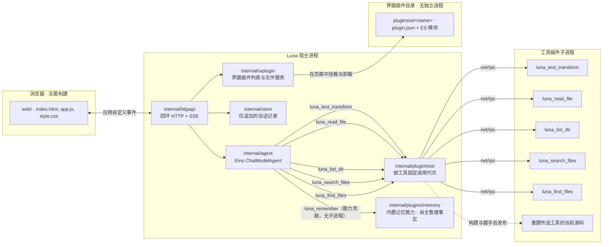

# Luna Agent

[](https://github.com/Qaraku/luna-agent/actions/workflows/ci.yml)

Luna Agent 是一个用 Go 编写、面向本地单用户的智能体内核，核心思路是：**工具在独立进程中运行，宿主无需重启即可替换它们。**

许多智能体框架将工具加载到宿主进程中，更改工具需要重启智能体，工具崩溃也可能拖垮整个进程。Luna Agent 通过 [HashiCorp `go-plugin`](https://github.com/hashicorp/go-plugin) 运行子进程工具：先验证替换候选，再统一发布；正在执行的调用固定使用启动时的代次，候选验证失败则由旧版本继续服务。

项目目前聚焦边界明确的内核实现，不是生产级智能体平台。同一时间只允许一轮运行，每轮记录以追加方式写入磁盘上的会话文件。

<a id="architecture"></a>

## 架构


```mermaid
flowchart LR
    subgraph Browser["浏览器 · 无需构建"]
        UI["web/ · index.html, app.js, style.css"]
    end

    subgraph Host["Luna 宿主进程"]
        API["internal/httpapi<br/>回环 HTTP + SSE"]
        Agent["internal/agent<br/>Eino ChatModelAgent"]
        PH["internal/pluginhost<br/>按工具固定调用代次"]
        Mem["internal/plugins/memory<br/>内置记忆能力 · 自主管理事实"]
        Store["internal/store<br/>仅追加的会话记录"]
        UIP["internal/uiplugin<br/>界面插件列表与文件服务"]
    end

    subgraph Plugins["工具插件子进程"]
        T1["luna_text_transform"]
        R1["luna_read_file"]
        D1["luna_list_dir"]
        S1["luna_search_files"]
        F1["luna_find_files"]
        C["重建所选工具的当前源码"]
    end

    subgraph UIPlugins["界面插件目录 · 无独立进程"]
        UIPlug["plugins/ui/&lt;name&gt; · plugin.json + ES 模块"]
    end

    UI <-->|"应用自定义事件"| API
    API --> Agent
    API --> Store
    API --> UIP
    Agent -->|"luna_remember（能力贡献，无子进程）"| Mem
    Agent -->|"luna_text_transform"| PH
    Agent -->|"luna_read_file"| PH
    Agent -->|"luna_list_dir"| PH
    Agent -->|"luna_search_files"| PH
    Agent -->|"luna_find_files"| PH
    PH -->|"net/rpc"| T1
    PH -->|"net/rpc"| R1
    PH -->|"net/rpc"| D1
    PH -->|"net/rpc"| S1
    PH -->|"net/rpc"| F1
    PH -.->|"构建与握手后发布"| C
    UIP -->|"在页面中挂载与卸载"| UIPlug
```

插件源码位于 `plugins/<tool>/`。宿主从可信注册清单选择源码目录，浏览器只能选择工具标识，不能提供构建路径或命令。

各层职责与接口边界如下：

1. **Go 核心**负责运行、取消、预算、工具子进程生命周期、事件流和磁盘会话记录。受上限约束的记忆事实由记忆（Memory）能力自行管理，不属于核心状态。Eino 类型不跨越 HTTP 边界。
2. **插件进程**各自负责一个工具的实现，只接收必要的环境变量，不接收模型凭据。
3. **浏览器界面**通过应用自定义的 HTTP/SSE（服务器发送事件）接口观察和控制核心。模型输出、工具参数和结果只通过 `createElement` / `textContent` 进入 DOM。界面插件由核心提供文件，在页面分配的容器内运行，使用下文说明的有限 `mount` / `unmount` 接口。

职责划分与热重载语义见 [架构说明](docs/architecture.md)，项目范围见 [路线图](docs/roadmap.md)。

## 助手行为

Luna 的通用行为指令位于 `internal/agent/prompts/core.md`，构建时嵌入主程序，不从当前工作目录加载同名文件。基础指令负责沟通、真实报告、用户授权和不可信内容处理；具体工具的用法、参数和上限由工具自身描述与已启用能力的上下文提供。提示词用于引导模型，不能替代宿主实施的权限与隔离。

## 日常界面

- **会话**：桌面左侧会话列表和“新建会话”，可以一键折叠、也可以拖动右边缘调整宽度；折叠后页头左边出现展开入口。折叠状态和宽度只存在浏览器本地。窄屏仍然按抽屉处理，通过页头“会话”按钮打开列表，选中后回到对话。
- **设置**：侧栏底部的“设置”打开一个独立模态，左侧是分类导航（外观 / 模型服务 / 能力 / 技能 / 工作区 / 界面扩展 / 诊断），右侧是内容面，内部自己滚动；关闭后回到原来的会话上下文。凡是“Luna 有什么、在用什么”的入口都在这里。“能力”列出内核当前注册的能力——各自的部署形态、是否在服务、贡献了哪些工具与上下文块、哪些路由与面板，并可在这里启用或停用，以及直接打开某个能力贡献的面板；声明与权限属于开发者信息，收在每行下面默认折叠的次级块里。停用只是把这些从服务里取下并如实重绘，能力自己的数据不动。“模型服务”编辑这台机器的模型服务提供方（provider）列表——每个提供方的名字、接口地址、密钥、默认模型与其他模型，标出使用中的那一个，新增、编辑与删除都在这里，删除要二次确认；密钥只写不读，界面上只有“是否已设置 + 末四位”。同一页只读显示当前在用的模型、提供方与两个运行预算，并列出当前提供方可用的模型、把当前会话切到其中一个；档位未设置时如实写作“未发送”，而不是补一个默认值。“工作区”列出本机定义过的工作区（一组目录），标出当前会话在用的那个并可以换；没有绑定时说清楚文件工具回到启动时的读取根。
- **会话权限与审批**：点击输入区的简短权限摘要，分别查看或设置读取、写入、联网与命令执行的“允许 / 询问 / 拒绝”。默认读取允许，其余询问；也支持 `/permissions write ask` 等命令。需要批准的操作先暂停，在正文中显示一次性审批卡。授予的提升权限只对当前会话、当前服务进程有效；重启或复制会话不会自动恢复授权。Full access 保留为需单独勾选确认的高级入口。详见 [会话权限说明](docs/execution-modes.md)。
- **运行组件（runtime widget）**：token 用量和运行活动不再占据输入区，默认隐藏；从输入区 `＋ → 运行组件` 显示或隐藏，可拖动、用方向键移动，也可在组件菜单里选择停靠位置和宽度。浏览器只记住布局，不保存运行内容或权限。用量仍按模型调用累计、按运行保存并可回放；重复快照不重复加算，缺项说明未知或已报告小计，不虚构费用。能力也可声明自己的 widget，启用时装载、停用时卸载，无需先打开面板。
- **输入区与模型选择**：统一 composer 默认只有输入和底边操作两层，左侧是能力、权限和已绑定项目入口，右侧是模型/思考摘要与发送按钮；生成时同一按钮切换为停止。没有常驻“就绪”、快捷键说明或统计行，菜单向上展开，不挤占正文。点击摘要或输入 `/model`、`/reasoning` 可切换；新会话第一条消息前也能设置并持久化。支持 `none`、`minimal`、`low`、`medium`、`high`、`xhigh`、`max`；实际支持范围由提供方与模型决定，不静默降档。`--default` 恢复全局设置，`/reasoning --off` 明确不发送字段，与 `none` 不同。Enter/点击应用命令参数，Tab 只补全。
- **工作目录与项目规则**：内置的工作区（Workspace）能力向模型贡献两条上下文——这个会话在哪些目录里工作（只用目录名，不写宿主绝对路径），以及这些目录自己的规则。**一个工作区是一个或多个目录的集合**（例如同时包含 `luna-agent` 和 `luna-agent-dev`），会话与它关联；每个目录的 `AGENTS.md` 作为“规则”进入上下文（默认文件名，`-rules-file` 仍可覆盖单根回退时的取值）。文件不存在只意味着那个目录没有规则；超限或不可读会被报告而不是截断。**没有关联工作区的会话走回退**，继续使用安装根/`-read-root` 的单根身份与规则，已有工作区绑定和目录顺序不变。读取设为“询问 / 拒绝”时不自动注入这些规则正文，避免绕过权限。`AGENTS.md` 的读取复用文件工具那套边界（`internal/fileread`，根就是那个目录），能力不新增权限声明。**工作区不等于写入授权**：它描述“在哪些目录里工作”；写入仍需单独授权，终端也不会因此自动获得写入或联网权限。
- **规则容量**：规则块（含目录标签）最多 32 KiB，按工作区顺序纳入完整文件；没有规则的目录不占份额，放不下的文件会明确报告，不会截取前缀。全部能力贡献的正文总上限为 64 KiB，使规则、记忆和技能可同时进入上下文。默认 `AGENTS.md`（含单根回退）使用目录边界校验；可信启动参数 `-rules-file` 仍可显式指定其他位置的文本文件。
- **记忆**：页头的“记忆”入口来自记忆能力贡献的面板——宿主按 `/api/state` 的 `capabilities[]` 渲染入口与容器，打开时加载能力自己的模块。面板的主体是生效中的事实（每条带来源与时间，可以就地撤回），已撤回的那些只占一行摘要，点开才列出：撤回记录是存储的事实，不是用户在主要界面上要看的一屏内容。不提供新增或编辑。
- **模型运行组件**：在“设置 → 能力”启用后，模型可通过 `luna_runtime_widget` 创建、更新、移除当前会话的状态、进度或指标卡片，并建议位置与显隐。只接受结构化文本数据，不执行模型提供的 HTML/JavaScript，也不修改权限；卡片标明“模型提供”，用户的布局和显隐选择优先。实例保存在当前服务内存，工具调用仍按既有规则记录到会话。
- **JSON 工具**：在“设置 → 能力”中启用后，页头出现独立面板。可直接格式化、压缩和校验 JSON，不需要模型凭据。面板与模型工具共用一个子进程实现，支持修改源码后单独重载；详见 [动手体验热插拔](docs/hot-plug.md)。
- **界面扩展**：本地界面插件的管理与内容展示在设置的“界面扩展”分类里，不再占用页头入口；启用状态仍然在刷新后重置。
- **外观**：在设置的“外观”分类里选择“跟随系统”“浅色”“深色”。切换只改根级主题变量，不重建会话或插件；插件可复用宿主的语义颜色、字体和基础控件样式。
- **运行详情**：页头的这个抽屉只说这一次运行用什么、还有多少余地——模型、提供方、思考档位、两个运行预算、会话状态与运行中的会话。**开发与排查用的东西不在它里面**：工具插件的代次与进程、工具源码的重建与替换、生命周期事件都在设置的“诊断”分类里，页头不再有第二个内置开关（能力贡献的面板入口与窄屏的会话抽屉不在此列）。

会话列表的标题单行省略，右侧的相对时间固定不收缩，因此侧栏只纵向滚动；折叠状态、宽度和主题是浏览器本地保存的三项界面偏好。

界面插件与主页面同源运行，受限的宿主接口不是安全沙箱。只启用可信的本地插件；主题与样式契约见 [架构说明](docs/architecture.md#界面主题与插件样式)。

<a id="what-the-kernel-does"></a>

## 当前能力

- 使用名为 `luna` 的 Eino `ChatModelAgent`，自动选择工具；模型调用默认最多 64 轮（`max_iterations`），同一模型轮次中的多个工具调用按顺序执行。
- 支持兼容 OpenAI 的模型服务接口。接口地址、密钥和模型由设置页写入 `provider.yaml`；运行预算与思考档位从环境变量及 `$XDG_CONFIG_HOME/luna/config.yaml` 读取，文件中的有效值优先，未设置的部分由环境变量补充。
- 共提供十三种模型可见工具。五种核心包装器由独立子进程提供，支持按工具重建当前源码；另外八种由能力贡献，其中 JSON 工具也使用独立子进程。JSON 工具、终端、文件写入、网页读取和模型运行组件默认停用，需用户在设置中启用；权限边界见下文。

  | 工具 | 部署 | 当前行为 |
  |---|---|---|
  | `luna_text_transform` | 子进程 | 去除文本首尾空白 |
  | `luna_read_file` | 子进程 | 读取宿主校验过的文件或指定行范围 |
  | `luna_list_dir` | 子进程 | 默认列一层目录，可指定最多五层；返回类型及普通文件大小 |
  | `luna_search_files` | 子进程 | 目录内容搜索，默认字面量，可显式选择正则 |
  | `luna_find_files` | 子进程 | 按名称通配模式查找条目，返回类型、路径和普通文件大小 |
  | `luna_remember` | 记忆能力 | 追加一条事实 |
  | `luna_recall` | 记忆能力 | 列出或按字面量检索生效事实，支持有界分页 |
  | `luna_skill_view` | 技能能力 | 按需读取技能正文或技能目录内文件 |
  | `luna_run` | 终端能力 | 按会话权限和本次请求挂载可读/可写范围，通过隔离代理联网；Full access 需单独确认 |
  | `luna_write_file` | 文件写入能力 | 在授权目录内创建或替换文本文件，并返回修改差异 |
  | `luna_web_fetch` | 网页读取能力 | 获取公网 HTTP(S) 网页的可读文本，说明触及的上限 |
  | `luna_runtime_widget` | 模型运行组件能力 | 当前会话的结构化状态、进度和指标卡片；用户布局优先 |
  | `luna_format_json` | JSON 工具能力（子进程） | 格式化、压缩和校验 JSON，保留大整数、重复键和键顺序 |

  版本号由插件报告，不是宿主预置菜单。故障与替代实现只用于测试夹具，不作为产品功能提供。

- 智能体可记住持久事实，这是记忆能力的职责，不属于内核业务。`luna_remember` 由内置记忆能力贡献，存储和规则均由该能力自主管理。文件默认仍为仅追加的 JSONL（每行一条 JSON 记录）`.runtime/memory.jsonl`，每条事实包含类型（`fact`）、文本、时间戳和来源会话；状态目录内的文件名由能力自行选择，不是内核配置。`-state-dir` 指定能力状态根目录：默认使用用户数据根；已有 `.runtime/memory.jsonl` 的仓库副本继续写入原位置，不迁移数据。已不再提供 `-memory-file` 参数。存储最多保留 200 条事实、合计 32 KiB 的编码记录，每条事实最多 500 个字符，超限时先淘汰最旧内容；所有完整行都计入上限，包括撤回记录，反复撤回不会使文件无限增长。每轮运行重新读取事实，由能力贡献一个上下文块；内核将它标为参考数据而非指令，并在预算内按行截断。注入内容保留最新最多 50 条、渲染后最多 8 KiB；事实内部换行会被合并，防止存储文本另起提示词行。模型通过两个工具使用记忆：`luna_remember` 追加事实，`luna_recall` 列出或检索当前生效的事实及记录时间，结果受上限约束并说明截断位置。两者都不能编辑或撤回事实，撤回仍由用户在记忆面板执行。记忆文件不可读会导致本轮失败，不会当作空记忆继续运行。

- 用户通过记忆能力贡献的面板查看和撤回事实；`GET /api/memory` 与 `POST /api/memory/retract` 也是这个能力贡献的接口，内核只负责挂载与守卫。`GET /api/memory` 列出生效与已撤回的事实；`POST /api/memory/retract` 按文本和时间戳共同匹配目标。撤回只追加记录，不就地修改事实；读取和上下文注入时排除被撤回的事实。字节上限计算所有记录，压缩重写时一起移除事实及对应撤回记录，避免反复撤回导致文件无限增长。模型侧现在有两个工具：`luna_remember` 追加一条、`luna_recall` 列出或检索此刻生效的事实（只读，每次调用现读，可分页）。仍然没有编辑或撤回工具——撤回依旧是用户在产品面板里做的事。
- **记忆检索与分页**：`luna_recall` 不传参数时仍返回最新最多 50 条，页内从旧到新；需要更早的事实时可传 `{"offset":50}`。新增的可选参数如下，检索针对**整个生效集合**，不是只搜索默认窗口：

  | 参数 | 行为 |
  | --- | --- |
  | `query` | 忽略大小写的字面量子串，匹配事实原文；中文可直接查询，`.*` 没有正则含义；空字符串表示不筛选 |
  | `offset` | 从较新端跳过多少条**匹配事实**，默认 `0`；每页仍从旧到新展示 |
  | `limit` | 每页最多返回 `1..50` 条，默认 `50` |

  例如 `{"query":"乌龙茶","limit":10}`；结果说明生效总数、匹配数、本页数量及剩余较旧匹配数。有下一页时给出 `next_offset`，继续时保持相同查询；没有下一页明确标为 `none`。超出末尾是空页，不会被说成“记忆为空”。每次调用重新读取有效集合，新增或撤回可能改变分页偏移量（`offset`），**不是冻结快照**。检索不会修改记忆，也不读取会话全文；默认空参数、`{}` 及原有根 `null` 调用保持兼容。


- 技能是一组供模型按需查阅的指令目录，由内置技能能力提供。技能位于技能根目录下，默认是 `$XDG_DATA_HOME/luna/skills`，也可通过 `-skills-dir` 补充。每个技能目录包含 `SKILL.md`，文件头部的 YAML 元数据需提供名称（`name` 必须与目录名相同）和描述（`description`，最多 1024 个字符）。发现阶段只读取元数据，将技能列表作为上下文块提供；内核将它标为过程知识，而不是参考数据或项目规则。模型请求时才加载正文，避免整个技能库占满提示词。`luna_skill_view` 可返回去掉元数据的 `SKILL.md` 正文，或该技能目录内一个文件的内容；它以技能目录为根复用文件工具的边界校验，越界路径在读取前拒绝，超限或二进制内容明确拒绝，不截断。技能文件超过 256 KiB 时报告问题，不读取内容；未知元数据字段会被忽略，避免第三方技能因新增字段而无法使用。同名技能按作用域覆盖：`builtin`（内置）< `user`（用户）< `project`（项目），被覆盖项仍会报告，不会静默丢弃。停用单个技能是用户偏好，不是停用整个能力，保存在 `$XDG_CONFIG_HOME/luna/settings.yaml` 中；该文件由 Luna 写入，与用户手动编辑的 `config.yaml` 不同。偏好在下一轮生效：停用的技能从清单移除，`luna_skill_view` 会明确说明它已停用，而不是说它不存在。

- 同一份设置文件还保存用户启用的能力（`capabilities.enabled`，未指定即停用）和允许写入的目录（`write.dirs`，未指定即不允许写入任何目录）。这些选择在重启后保留，并且先持久化、再改变运行状态；保存失败意味着变更未生效，可以安全重试。

- 模型的四种**读取工具**只读、有上限，并共用同一套边界。`luna_read_file` 读取文件，`luna_list_dir` 列出目录，`luna_search_files` 搜索目录中的文本（默认按字面量，可显式选择 RE2 正则模式），`luna_find_files` 按名称查找目录下的条目。路径均相对于会话的工作目录：**按顺序尝试会话绑定工作区中的目录**；未绑定工作区时回退到单一配置根，保持原有会话的行为。路径只由宿主解释：先规范化，拒绝绝对路径和 `..` 越界，再解析符号链接，确认目标仍在允许的目录内。列目录、搜索和查找都不能超出读取范围；一个目录中的越界路径不会被兄弟目录救回，越界调用在插件运行前就会被拒绝。

  整文件读取超过 256 KiB 时明确拒绝，不截断；含 NUL 字节的内容按二进制拒绝。大文件可用 `start_line`（从 1 开始）和 `max_lines` 读取指定行范围：逐行扫描，不先整读再截取。结果说明返回了哪些行、还剩多少行；起始行超出文件末尾时返回拒绝及总行数，而不是空结果。

  目录列表默认只列一层，也可指定 `depth` 为 1 到 5，一次列出相应层数。超出范围会拒绝，不会强行限制到最近有效值。第一层以下使用相对于所选目录的路径，子目录内容紧跟在目录条目后。每项带类型（`dir`、`file`、`link`、`other`），普通文件还带大小；目录优先，其后为文件和链接，各组按名称排序。单次最多检查 20000 个条目、展示 200 个条目，每行最多 160 字节；达到上限时说明触及哪项上限及未检查范围，不会静默返回部分内容。任何深度都不跟随符号链接。

  内容搜索默认按字面量理解查询；`mode` 为 `regex` 时，将查询编译为 RE2 正则表达式，逐行匹配。Go 正则引擎采用线性时间算法，不回溯。默认使用字面量不是为了回避正则回溯，而是避免意外匹配，例如将 `docs/architecture.md` 当正则时也会匹配 `docsXarchitecture.md`。无效表达式会被拒绝，不会当作无匹配；`mode` 只接受 `literal` 和 `regex`，结果头部会说明实际使用的模式。搜索受匹配行数、行长度、读取文件数和单文件大小约束，按同样的 NUL 规则跳过二进制内容；触及上限时说明未搜索范围，不会把部分结果当作完整答案。

  名称查找用通配模式（glob，如 `*`、`?`、`[abc]`）匹配完整条目名，而不是子串：`main.go` 只匹配该名称，`*_test.go` 可匹配任意深度的 Go 测试文件。每项一行，带类型、普通文件大小及相对查找起点的路径；目录以尾部斜杠标记，不会与文件混淆。符号链接只按自身名称报告，不进入目标。查找受返回路径数、行长度和检查条目数约束，达到上限会明确说明剩余条目未检查。空模式、针对路径的模式和无效通配模式均在读取目录前拒绝。

  插件只接收已验证的绝对路径与各项上限，不自行解释路径。回退根默认是解析后的仓库根，可用 `-read-root` 指定。记忆也不赋予模型任意文件写入能力：模型通过记忆能力贡献的工具写入，而不是提供文件路径。

- 模型也能**修改文件**，但必须启用对应能力并遵循会话权限。`luna_write_file` 创建/替换一个文本文件并返回差异；`luna_run` 默认只读，只有显式请求并获准的目录才可写。工作区设置中的目录是自动写入范围，范围外仍须是当前项目路径并获得单次批准；目录调整从下一轮生效，不能覆盖“询问 / 拒绝”策略。写入目标与读取同一路径时一致：如果工作目录中已有同名目标，优先使用包含该目标的目录；多处存在时取顺序中的第一个，避免把刚读过的文件误写成另一个目录中的同名副本。

  写入复用读取的路径校验代码：规范化路径，拒绝绝对路径和 `..` 越界，解析符号链接；目标本身是链接时也拒绝，因为重命名会替换链接而非链接指向的文件。仅写文本，上限为 256 KiB；保留已有文件权限，不创建目录，不删除文件；内容无变化时不写入，也不更新修改时间。拒绝调用时磁盘保持不变，错误会区分“尚未授权任何目录”和“此目录不在授权范围”，让用户知道需要处理什么。返回的差异只去掉两端共同的行，中间剩余内容先列 `-` 行、再列 `+` 行，不保证最小编辑序列。差异输出最多 8 KiB，截断时说明上限和省略的字节数，不会把不完整差异当作全部变化。

- **终端执行模式**：`luna_run` 的模式来自内核核准的运行快照，不接受模型参数自行切换。
  - **受限执行（默认）**：Bubblewrap 默认只读且离线；`write:true` 和 `write_dirs` 请求指定目录可写，`network:true` 请求公共 HTTP(S)/CONNECT 代理，`read:false` 可在不挂载项目的私有 scratch 中执行。参数只是请求，批准前不执行；仍无法访问宿主/私网地址、宿主进程或 pathname Unix socket，不提供直接网络套接字或 UDP。隔离不可用时明确失败，**不回退到 Full access**。
  - **Full access（用户确认后）**：直接使用宿主 `/bin/sh -c` 和当前系统用户的权限，允许工作区外目录、文件与宿主网络。它不是沙箱，也不是 root 提权；可能读取凭据、改删文件或影响 Luna 本身。只传入必要的 `PATH`、`HOME`、`TMPDIR`，不自动传入模型配置密钥，但这不阻止已授权命令自行访问宿主文件。
  - 两种模式都保留默认 30 秒、最多 120 秒及合计 32 KiB 输出上限，不提供交互式标准输入。Full access 停止时清理本次进程组，但不能保证控制故意脱离进程组的程序；不要把资源上限当成安全隔离。


- 模型可通过网页读取能力**获取网络页面**。`luna_web_fetch` 默认停用，需用户启用，并先遵循会话的联网策略；可访问范围由能力自身判断，无需维护地址列表。每次获取一个 URL，最多跟随五次重定向、耗时 20 秒、读取 1 MiB 响应正文并返回 16 KiB 文本，触及任一上限都会在结果中说明。返回内容保留标题、列表项和链接目标，去掉脚本及导航等页面装饰；这是启发式文本提取，不是忠实的页面渲染，工具说明会明确这一点。只接受 HTTP(S)，拒绝本身是或解析为非公网地址的主机，包括回环、私有网段、链路本地和 IPv6 唯一本地地址，也拒绝嵌入其他地址的前缀（6to4、NAT64）。这些检查同样在实际连接时执行，防止重定向或 DNS 解析变化绕过限制。非文本响应会被拒绝，并报告内容类型。进程启动时设置的 `HTTP_PROXY` / `HTTPS_PROXY` 会生效；界面不提供代理设置，需在启动环境中配置。

- **验证后热重载**：所选插件工具完成构建、启动、握手和元数据检查后，才统一发布新代次；可以只重载一个，也可以重载全部，未选工具不受影响；进行中的调用始终使用原代次，直到调用结束后再回收旧进程。
- HTTP 服务仅监听回环地址，变更请求受来源校验保护，请求体有大小上限；整轮运行默认限时 15 分钟（`run_timeout`）。
- SSE 使用应用自定义的公开事件，不暴露 Eino 或插件 RPC（远程过程调用）结构；每个可写事件流恰好发送一个终止事件。
- **连续会话的完成边界**：HTTP 层等运行器（Runner）退出并收齐事件后，先释放运行准入，再发出唯一终止事件。收到终止事件后可以直接发送下一句，不必为上一轮的收尾自动重试；运行器尚未退出时仍拒绝并发运行。
- **运行记录持久化**：每个会话对应 `-sessions-dir` 下一个仅追加的 JSONL 文件，默认位于用户数据根下的 `<data>/sessions`；已有 `<root>/.runtime/sessions/` 的仓库副本继续使用原位置，启动时说明最终选择。每条记录用一次 `Write` 写成一整行；异常中断留下的未完成尾行不会作为完整记录读取。模型运行前先追加用户消息，随后记录每次工具调用、助手回答和本轮状态。无法写入记录时本轮报告失败，不会假报成功。
- **会话历史回放**：每轮输入依次为系统提示词、会话已有消息和当前用户消息。系统提示词包含基础指令及已启用能力贡献的上下文块；内核按各块类型标注用途，并在各自预算内按行截断。历史最多保留最近 40 条消息和 64 KiB 消息文本，超限先丢弃最旧消息。尚未实现会话历史的摘要或检索；历史按顺序回放，记忆则在自身上限内注入最近事实，不按相关性筛选。这与模型主动调用 `luna_recall` 进行字面量检索是两回事。
- **会话设置一致性**：模型选择、思考档位、权限与工作区绑定共用读—合并—追加事务，并发修改不会相互覆盖；读取配置失败时不写入、不假报成功。保存只追加记录，不改写会话历史。
- **长会话读取**：会话日志逐行校验；列表只聚合摘要，模型历史只保留消息，不先加载整份工具调用记录。完整回放仍返回全部记录，已有大行和残行规则不变；不新增缓存或索引，读取仍需扫描日志。

- **运行时界面扩展**：界面插件是 `plugins/ui/<name>/` 目录，包含 `plugin.json` 和导出 `mount(target, api)`、`unmount(target)` 的 ES 模块。宿主向 `mount` 提供容器元素和有限接口（日志回调及宿主版本），通过 `GET /api/ui-plugins` 列出发现的插件，同时报告跳过的目录及原因。文件只能从插件自己的目录提供，边界校验复用文件工具的实现。插件通过 `unmount` 清理自身监听器和定时器；即使它抛错，宿主仍移除容器并报告错误，避免残留半挂载状态。启用状态不持久化，刷新后全部停用。

- **工具失败分为两类**。路径拒绝、读取超限、二进制内容、参数格式错误等属于**调用拒绝**：界面收到 `tool.failed`，模型收到拒绝原因作为工具结果，本轮继续，由模型用用户语言解释。无可用插件、导致插件终止的 RPC 超时或取消、插件进程消失等属于**基础设施故障**：以错误结束本轮，产生 `run.failed`，而不是让模型继续调用已无法服务的插件。

- **能力**承载用户可感知的产品功能，内核只负责运行机制。每个能力声明贡献的工具、上下文块、HTTP 路由和浏览器面板，以及资源占用声明（路由前缀、面板标识、状态命名空间）和所需权限。其生命周期状态为 `registered` / `enabled` / `disabled` / `failed`。注册时拒绝重复占用的名称、未在描述中声明的接口和未经内核授权的权限。`GET /api/state` 通过 `capabilities[]` 返回所有已注册能力的 `id`、`title`、`deployment`、`state`、`contributions`、`claims`、`permissions`、`panels`，不包含能力存储的数据。`POST /api/plugins/{id}/enable|disable` 切换状态；停用会一起移除工具、上下文、路由和面板，**不删除数据**，清理数据必须单独明确操作；不允许的状态转换返回 `409`。记忆、工作区和技能等能力均按这一机制装配，内置只是部署选择，不代表额外特权。停用后，其工具从下一轮的模型工具集中移除；装配清单变化时会重建智能体。

<a id="quick-start"></a>

## 快速开始

环境要求：Go 1.24 或更新版本；只有运行浏览器 JavaScript 测试时才需要 Node.js 22。当前 Go 1.27 验证环境会出现 Sonic 不支持该工具链并回退到 `encoding/json` 的提示；这不是启动失败，应用会继续运行。该提示反映依赖与工具链的兼容范围，不是模型服务配置错误。

终端的默认隔离模式需要 Linux amd64/arm64、`/usr/bin/bwrap`（Bubblewrap）、可用的用户命名空间（user namespace）和系统调用过滤机制（seccomp）。已有实机验证环境为 Linux amd64 + Bubblewrap 0.12.0；其他能力不依赖它。缺失依赖或系统禁止隔离时应用仍可运行，但隔离模式的终端调用明确失败；不会自动改用 Full access。Debian/Ubuntu 可通过系统包管理器安装 `bubblewrap`；CI（持续集成）会安装它，并要求隔离测试真正执行。

```sh
git clone https://github.com/Qaraku/luna-agent
cd luna-agent

go run ./cmd/luna
```

日常启动默认使用固定地址 `http://127.0.0.1:3210`，进程会打印实际监听地址和解析后的根目录：

```text
LISTEN_URL=http://127.0.0.1:3210
ROOT=/path/to/repo
```

打开该地址，进入**设置 → 模型服务**。每行对应一个模型服务提供方，包含名称、接口地址、API 密钥及可用模型，并标出当前使用项。Luna 将列表写入配置目录中的 `provider.yaml`。因此首次启动无需预先配置模型服务，也能打开设置页完成配置。

添加另一个模型服务只需新增一行；点击选择后，下一条消息就使用它，无需重启，因为配置在每轮开始时读取，而不是只在进程启动时读取。页面还可通过“获取模型列表”查询接口，并允许选择返回的模型或手动填写名称。

根目录按以下顺序确定：显式指定的 `-root`（必须包含 `web/index.html` 和 `plugins/`）、可执行文件的上两级目录（对应 `<repo>/.runtime/luna` 布局）、当前工作目录。最后一项使新克隆的仓库可直接运行 `go run ./cmd/luna`。

会话默认写入用户数据根下的 `sessions/`，可用 `-sessions-dir` 改到其他目录。已有 `.runtime/sessions/` 的仓库副本继续使用原位置，不会自行搬迁；启动日志会说明所选位置及迁移后的目标位置。记忆事实保存在记忆能力状态根下的 `.runtime/memory.jsonl`，命名空间和文件名由该能力决定，不是内核配置。状态根默认使用用户数据根；若解析后的仓库根下已有 `.runtime/memory.jsonl`，则继续使用该位置。可用 `-state-dir` 指定状态根。

也可以先编译，将二进制文件放在约定的 `<repo>/.runtime/luna` 位置：

```sh
mkdir -p .runtime && go build -o .runtime/luna ./cmd/luna
./.runtime/luna
```

如需换端口，可显式传入 `-addr 127.0.0.1:43210`。端口占用会明确报错，不会自动换号或停止已有进程。`-addr 127.0.0.1:0` 表示让系统分配临时端口，只用于测试或临时运行；每次地址可能不同，不建议作为日常启动命令。固定地址也让浏览器主题、侧栏等同源偏好在重启后继续使用。

每次热重载都会编译替换插件，因此运行时的 `PATH` 中也必须能找到 Go 工具链。

<a id="configuration"></a>

### 配置

Luna 调用哪个模型服务、使用哪把密钥，属于当前安装实例的配置，不由启动脚本的环境变量决定。设置页将具名模型服务列表和当前使用项写入 Luna 管理的文件：

```yaml
# ~/.config/luna/provider.yaml   （权限 0600，由 Luna 写入）
active: deepseek                   # 当前运行使用的模型服务
providers:
  deepseek:
    base_url: https://api.deepseek.com/v1
    api_key: sk-...                # 由设置页写入，不向浏览器返回完整密钥
    model: deepseek-chat           # 默认请求的模型
    models:                       # 可通过 /model 切换的其他模型
      - deepseek-reasoner
  local:
    base_url: http://127.0.0.1:11434/v1
    api_key: none
    model: qwen3
```

模型服务列表为空表示尚未配置；列表非空却没有用 `active` 指定有效条目时会拒绝配置，避免本轮运行无法确定目标。

仍兼容旧版在顶层直接保存 `base_url`、`api_key`、`model` 的格式，读取时将其视为名为 `default` 的模型服务。已有安装可继续使用，下一次保存时才写成上面的新格式。

模型服务配置文件不可读时，Luna 会在启动时记录一次错误，但仍提供页面；设置页、`/api/state` 和运行失败信息会报告原因。原文件保持不变，不会静默重写。当前设置接口不能绕过读取错误直接覆盖损坏文件，修复仍需用户处理，不能把“页面可打开”理解为已经支持自动恢复。

`config.yaml` 由用户手动编辑，Luna 只读、不重写，也不会改动其中的注释。它保存两个运行预算和思考档位，不接受接口地址、密钥或模型；模型服务配置统一由设置页管理，避免多个来源互相覆盖。

```yaml
# ~/.config/luna/config.yaml
reasoning_effort: high
max_iterations: 64            # 每轮运行最多调用模型的次数
run_timeout: 20m              # 每轮运行的最长时间
```

文件不存在不算错误，空文件视为空配置；未知字段会被拒绝，而不是静默忽略，避免拼错的配置不生效却没有提示。启动时会说明读取了哪个文件。

尚未配置模型服务也不影响启动，Luna 会说明缺少哪些设置并提供设置页。此时发起运行会得到明确的缺项说明，而不是模型服务端的错误。保存有效配置后，下一轮即可使用，无需重启。

| 环境变量 | 必填 | 说明 |
|---|---|---|
| `LUNA_HOME` | 否 | 将配置、会话、能力状态和缓存统一放在一个目录。设置后覆盖所有 XDG 根目录及旧位置，开发时可用 `LUNA_HOME=$PWD/.runtime` 将数据放在仓库旁。相对路径会被拒绝，启动时打印实际位置 |
| `LUNA_REASONING_EFFORT` | 否 | 通过 API 的 `reasoning_effort` 指定思考档位，可选 `minimal`、`low`、`medium`、`high`、`none`。未设置时完全不发送该字段，不影响未定义它的服务。具体效果由服务决定；已有对 `api.deepseek.com` 的验证中，该字段被接受，但未观察到可测量差异 |
| `LUNA_MAX_ITERATIONS` | 否 | 每轮运行的模型调用次数上限，文件中的 `max_iterations` 优先。默认 64 次，单次模型响应可包含多个工具调用；复杂任务可提高上限。达到上限时本轮失败，错误说明限制值和此变量名 |
| `LUNA_RUN_TIMEOUT` | 否 | 每轮运行最长时间，采用 Go 时长格式，如 `20m`、`90s`，文件中的 `run_timeout` 优先。默认 `15m`；超时以 `run.cancelled` 结束，原因为 `timeout`，不记为运行失败 |

接口地址、密钥和模型不提供环境变量入口，以免环境变量静默覆盖这台安装实例已保存的模型服务配置。

启动错误只说明缺少的变量名，不打印变量值。

<a id="local-api"></a>

## 本地 API

| 方法 | 路径 | 用途 |
|---|---|---|
| `GET` | `/healthz` | 检查配置就绪状态，以及白名单内每个插件工具是否有活跃代次；不会调用模型服务 |
| `GET` | `/api/state` | 返回有界运行状态：模型名、服务主机名、宿主 PID（进程编号）、各插件工具记录（工具名、版本、代次、插件 PID、状态、进行中的调用数）、已注册的可重载工具 `reloadable_tools`、忙碌标记、两个运行预算（`max_iterations`、`run_timeout_ms`）、启动时的思考档位（未选择则省略）、当前运行与会话标识（空闲时为空）、缺失配置 `provider_missing`、文件读取问题 `provider_problem`、生命周期事件，以及 `capabilities[]`。配置不可读时，模型和服务主机名仍为进程启动时的值。每个能力条目含 `id`、`title`、`deployment`、`state`、`contributions`、`claims`、`permissions`、`panels`，不含 API 密钥或能力存储的数据 |
| `GET` | `/api/commands` | 返回输入框命令表，每项含 `name`、`summary`、`usage`、`category`、`aliases`、`args`（`none` / `text` / `options`）、固定候选集合 `options`（适用时）及 `busy`（`allow` / `reject`，表示运行中能否使用）。浏览器据此渲染候选与帮助，不重复维护命令定义。`/model` 取自当前模型服务，仅在至少有一个模型时出现，随配置保存更新；无命令时返回空列表 |
| `GET` | `/api/provider` | 返回模型服务配置的界面视图：`active`（当前服务名，未选时为空）、按名称排序的 `providers[]`（各项含 `name`、`base_url`、`model`、`models`、`key_set`、`key_hint`）、`configured`（当前能否发起运行）、`missing`（仍缺少的配置，使用文件字段名 `provider` 或当前条目字段）及文件名。完整密钥不返回，只提供是否设置及末四位。没有“需要重启”字段，因为下一轮会直接读取该文件 |
| `PUT` | `/api/provider` | `{"active":"...","providers":[{"name":"...","base_url":"...","model":"...","models":[...],"api_key":"...","clear_api_key":false}]}` 整体替换配置，请求中不再列出的服务会被移除。空 `api_key` 保留同名服务已有密钥；`"clear_api_key":true` 才会清除密钥。名称重复或 `active` 指向不存在的条目时返回 `400` 及原因，不写文件。属于变更请求，需来源精确匹配 |
| `POST` | `/api/provider/models` | 查询某个接口支持的模型，返回 `{"models":[...],"problem":""}`；服务端错误写入 `problem`，不作为 HTTP 错误，便于页面在字段旁展示原因。`name` 指定正在编辑的服务，`base_url` / `api_key` 可使用表单尚未保存的值；省略项从同名已保存条目读取，无需重新输入密钥。此操作会使用当前安装实例的密钥发起外部请求，因此需来源精确匹配 |
| `GET` | `/api/models` | 返回当前可选模型：`name`、`provider`（服务名），首项标记 `default`；同时返回会话将使用的模型及来源 `{"name":"...","origin":"session"\|"global"}`。读取当前模型服务配置，保存后立即反映。`?session=<id>` 指定会话，省略时只描述全局配置；会话不存在返回 `404`，标识格式错误返回 `400` |
| `GET` | `/api/execution` | 返回当前有效 `mode`、保存的 `requested_mode`、`needs_confirmation` 与授权范围；可用 `?session=<id>` 查询会话。重启后保存的 Full access 偏好需要重新确认 |
| `POST` | `/api/sessions/{id}/execution` | 选择 `sandbox` 或 `full_access`；后者必须带 `confirm_full_access:true` 并要求精确 Origin。授权仅在当前服务内存中生效，运行中拒绝更改，未确认的偏好不能启动运行 |
| `GET` | `/api/reasoning` | 返回支持的档位 `levels` 与 `current`（`reasoning_effort`、`origin`）；`?session=<id>` 查询会话有效选择，省略时查询全局设置 |
| `POST` | `/api/sessions/{id}/reasoning` | 接受 `{"reasoning_effort":"high"}` 或 `{"reset":true}`，两者互斥；空字符串表示不发送字段，重置表示继承全局。追加配置时保留模型和工作区，要求精确 Origin |
| `GET` | `/api/skills` | 按发现顺序列出技能：`name`、`description`、`scope`、`enabled`，停用时含 `disabled_reason`。描述过长会截断并说明，不会静默截断；无技能时返回空列表 |
| `POST` | `/api/skills/{name}/enable` · `/disable` | 启用或停用单个技能并返回新状态。偏好写入 `$XDG_CONFIG_HOME/luna/settings.yaml`，运行时列表随即更新，无需重新构建；技能清单每轮读取。未知名称返回 `404`，不会保存不存在技能的偏好；两者均为变更请求，需来源精确匹配 |
| `POST` | `/api/sessions/{id}/model` | `{"model":"..."}` 指定会话后续运行使用的模型，或用 `{"reset":true}` 恢复跟随全局默认（不能同时提供）。以 `config` 记录追加到会话文件，重启后保留并随会话保存。模型不在配置中返回 `400`，会话不存在返回 `404`；需来源精确匹配。记录与现有会话配置合并，不会解除工作区绑定 |
| `GET` | `/api/workspaces` | 返回具名工作目录集合：`{"workspaces":[{"id":"...","name":"...","dirs":["..."]}]}`；无工作区时返回空列表 |
| `POST` | `/api/workspaces` | `{"name":"...","dirs":["..."]}` 创建并返回工作区。`name` 可省略，默认使用首个目录的基本名称；目录必须为绝对路径，按原顺序去重，至少保留一个。名称重复返回 `409`，其他参数错误返回 `400` 及原因 |
| `POST` | `/api/sessions/{id}/workspace` | `{"workspace":"<id>"}` 绑定工作区，`{"workspace":""}` 解除绑定，恢复会话初始状态。与现有配置合并，不丢失模型选择；工作区或会话不存在返回 `404`，需来源精确匹配 |
| `POST` | `/api/sessions` | 以 `{}` 或 `{"title":"..."}` 创建空会话，返回 `201` 与会话详情，不调用模型。未指定标题时，后续展示使用第一条用户消息生成的标题；要求精确 Origin |
| `GET` | `/api/sessions` | 按更新时间从新到旧返回会话摘要：`id`、`title`、`updated_at`、`run_count` |
| `GET` | `/api/sessions/{id}` | 返回用于回放的会话：`id`、`title`、`created_at`、`updated_at`、`run_count`、`truncated`、`workspace`（当前工作区或 `null`），以及按文件顺序排列的 `records`。会话不存在返回 `404`，标识格式错误返回 `400` |
| `POST` | `/api/reload` | `{"tool":"luna_read_file"}` 重建并替换指定的已注册工具；`{}` 或空 `tool` 重载全部。只选择注册身份，不接受路径或旧演示参数；所选实现全部验证后才发布，失败保留旧进程，不改变能力启停状态 |
| `POST` | `/api/plugins/{id}/enable` | 启用内置或子进程能力，恢复其工具、上下文块、路由和面板。标识未知或当前状态不允许转换时返回 `409` |
| `POST` | `/api/plugins/{id}/disable` | 一起停用该能力的所有贡献，保留已存储数据。停用不是删除，也不是热重载 |
| `POST` | `/api/runs` | `{"message":"...","session_id":"..."}` 发起运行。`session_id` 可省略；提供时必须指向已有会话，不存在返回 `404`，格式错误返回 `400`，均在运行准入前拒绝。省略时新建会话，通过 `run.started` 返回标识。响应为 `text/event-stream`，事件类型见 [架构说明](docs/architecture.md) |
| `POST` | `/api/runs/{id}/cancel` | 停止标识匹配的当前运行，返回 `202` 和 `{"run_id":"...","state":"cancelling"}`，事件流以 `run.cancelled` 结束。标识不属于当前运行或运行已结束时返回 `404`，不猜测目标；结束过程中重复取消仍返回同样的 `202` |
| `GET` | `/api/ui-plugins` | 返回可发现的界面插件及所有被跳过的目录和原因。格式错误的插件会被报告，不会静默忽略，也不会使整个列表返回 `500` |
| `GET` | `/api/ui-plugins/<name>/<file>` | 提供插件目录内的单个文件，规范化和解析符号链接后都必须在目录边界内；未知扩展名会拒绝，不猜测 `Content-Type` |
| `POST` | `/api/json-format/format` | 由启用中的 JSON 工具能力提供，接收 `text` 与可选 `mode`（`pretty` / `compact`），返回文本和实际进程元数据；不调用模型、不保存输入，要求精确 Origin |
| `GET` | `/api/json-format/panel.js`, `/api/json-format/panel.css` | JSON 工具能力自己的面板资源，停用后一起退出服务 |
| `GET` | `/api/memory` | 由记忆能力提供，列出生效和已撤回的事实，不暴露存储记录类型。模型不直接调用此 HTTP 接口，而是通过上下文注入及 `luna_recall` 工具读取记忆 |
| `POST` | `/api/memory/retract` | 由记忆能力提供。`{"at":"...","text":"..."}` 按时间戳和文本共同确定并撤回一条生效事实：成功返回 `200`，事实未生效返回 `404`，请求格式错误返回 `400` |
| `GET` | `/api/memory/panel.js`, `/api/memory/panel.css` | 记忆能力通过自己的路由提供面板资源。样式作为文件加载，不注入 `<style>` 元素，因为服务端内容安全策略（Content-Security-Policy）禁止后者 |

变更请求的浏览器来源（Origin）必须与实际监听地址精确匹配。不支持跨源资源共享（CORS），也不提供公网部署模式。

<a id="observing-a-hot-reload"></a>

## 观察热重载

想直接体验一个实际用途，可先按 [JSON 工具热插拔指南](docs/hot-plug.md) 操作，无需调用模型。

1. 启动 Luna，在**设置 → 诊断**查看宿主和各工具的 PID、版本及代次。
2. 修改要更新的 `plugins/<tool>/main.go`，在“重载工具源码”中选择对应工具并点击“重建并重载”。也可先不改源码，验证同版本重建：选中工具的 PID 和代次变化，宿主与其他工具不变。
3. 通过文件工具再次读取或查询项目，核对实际结果。正在执行的旧调用仍使用原进程，完成后旧进程退出。
4. 若源码无法编译或新进程握手失败，界面说明失败，旧实现仍继续服务；修复源码后重试即可，不需要切换到一个预置的“稳定版本”。

接口操作示例（地址应与本次启动的 `LISTEN_URL` 一致）：

```sh
curl --fail-with-body -sS http://127.0.0.1:3210/api/reload \
  -H 'Origin: http://127.0.0.1:3210' \
  -H 'Content-Type: application/json' \
  --data '{"tool":"luna_read_file"}'
```

空对象 `{}` 会重建全部已注册工具；全量重载仍是全有或全无，不会发布一个只更新了一半的集合。重载只更新工具子进程，不更新 Go 核心或浏览器页面。

<a id="verification"></a>

## 验证

常用检查命令如下；完整发布检查以 [协作规则](AGENTS.md#验证与运行) 为准。下方是既有测试覆盖与历史验证记录，不代表本轮文档调整重新执行了这些检查：

```sh
go test -race ./...
go vet ./...
go build -o .runtime/luna ./cmd/luna
node --check web/app.js
node --check web/runtime-widgets.js
node --test web/app.test.cjs web/runtime-widgets.test.cjs
```

此前的界面重做通过 JavaScript 语法检查与 50 项 Node 测试。隔离 Chromium 使用确定性接口夹具验证了会话切换与刷新恢复、记忆查看与撤回、轮询焦点保持、运行中禁用会话切换、草稿保留、抽屉键盘操作、窄屏缩放，以及当时新增的明暗主题与跟随系统、显式选择的持久化和存储失败回退、选中项与侧栏背景的区分、主要文字的自选对比度（均不低于 4.5:1）、1440px 与 390px 下没有元素越出视口，还有真实计数器插件在切换主题时保留挂载实例、停用时释放定时器。这不代表真实模型或 Go 服务的端到端验收。

以下为既有测试覆盖与历史验证记录：

Go 单元与集成测试覆盖：配置别名处理；白名单工具各自独立进程；真实子进程替换及旧调用排空；损坏候选回滚并保留活跃代次；RPC 超时终止；调用中插件进程被杀时归类为基础设施故障；宿主文件读取边界（绝对路径、`..` 越界、符号链接逃逸、非普通文件、大小上限和二进制内容）；目录列表的同等校验（非目录或不存在路径拒绝、默认一层或显式深度、任何深度不跟随链接、明确说明三项上限）；名称查找校验（完整名称匹配、目录标记、不跟随链接、明确说明路径与模式上限）；调用拒绝作为结果返回模型而基础设施故障终止运行；严格工具参数结构和尾随 JSON 拒绝；顺序工具执行；助手文本流式输出，工具调用轮次的文本作为运行备注而非最终回答；假模型下确定性的 Eino 事件映射；整轮超时和取消清理；SSE 恰好一个终止事件；界面插件列表与目录边界；HTTP 守卫。断连后的专项竞态回归曾通过 50 次重复竞态检测。

历史端到端验证还覆盖了确定性测试无法替代的路径：

- 使用 `api.deepseek.com` 的 `deepseek-flash` 模型发起真实请求，未强制指定 `tool_choice`，模型自动选择了 `luna_text_transform`。`v1` 返回 `moon light`，应用报告对应代次与插件 PID；重载后 `v2` 使用新代次和 PID，返回 `Luna · MOON LIGHT`。`broken` 重载失败后，`v2` 仍可调用。
- 真实无头 Chromium 交互验证了 `v1`、`v2` 和 `broken` 失败路径；轮询与重载期间输入草稿保留，无页面错误，桌面和 390 px 视口均无横向溢出。
- Desktop Preview（桌面预览）独立打开了运行中的回环地址应用，读取了界面可见的模型、服务提供方、宿主和插件元数据。
- 在临时目录中的干净代码副本执行 `go run ./cmd/luna`，成功提供界面并发布插件代次 1。
- 当时的最终独立审查未发现安全问题或逻辑错误。

上述真实模型服务、无头 Chromium、桌面预览和干净仓库验证针对的是最初只有一个工具的内核。增加第二个工具时，只重新执行了 Go 竞态测试、静态检查、根应用构建、Go 格式检查、Node 语法检查和测试，没有再次调用真实模型或运行真实浏览器。

会话后端改动也只重新执行了上述检查，没有启动服务或调用模型。因此，当时不声称会话接口、真实崩溃下的仅追加存储、历史回放和终止事件契约已通过端到端验证，也未用浏览器验证这些路径。后续 `web/` 提交加入会话前端，并重新执行相同检查及浏览器 JavaScript 测试。

运行时界面插件改动同样只执行了上述检查，没有启动服务、调用模型或运行浏览器，因此当时未声称插件列表、文件服务、挂载与卸载及宿主清理已通过端到端验证。

最初的记忆后端改动由确定性检查覆盖，包括 `internal/plugins/memory` 包和 `internal/agent` 中的记忆路径测试；当时没有运行服务、真实模型或浏览器，因此没有验证真实崩溃下的文件行为、真实模型请求中的注入或真实运行中的记忆事件。当前界面已支持通过页头“记忆”入口查看与撤回事实，但不支持新增或编辑。记忆工具由内置能力贡献并由内核统一装配和包装，不是子进程工具，因此不出现在 `/api/state` 的插件记录或 `/healthz` 的插件就绪要求中。

工具拒绝处理改动通过相同检查，未调用模型服务。问题来自用户验收：读取不存在的文件会用宿主原始错误终止整轮，既没有模型回答，错误也难以理解。修改后，拒绝作为工具结果返回，本轮继续，由模型解释；基础设施故障仍终止本轮。还曾在代码副本中恢复旧行为，确认两类回归测试会失败，证明测试确实能捕获缺陷。

记忆查看与撤回改动通过相同确定性检查。测试覆盖：按文本与时间戳共同匹配、一次只移除一个生效事实；拒绝撤回未生效事实；重新打开后撤回仍生效；字节上限计入撤回记录，防止反复撤回使文件无限增长；压缩重写时同时清理事实及对应撤回记录。接口测试覆盖返回结构、`400`、`404` 和 Origin 校验，以及损坏文件必须报错而不能显示为空。未调用模型服务。

具名模型服务配置改动通过相同确定性检查，并完成两组隔离验证（`.evidence/provider-list/`）。服务级验证在独立 `LUNA_HOME` 下运行真实二进制，对接两个假的兼容 OpenAI 接口，共 38 项检查：首次启动没有 `provider.yaml`；**进程运行期间**保存服务后，下一轮直接访问该接口，无需重启；切换 `active` 后下一轮访问另一个接口；引用不存在服务的保存请求被拒绝且不写文件；响应和启动日志不出现完整密钥；环境中没有 `OPENAI_*` 变量。还验证了旧格式配置（按 `default` 读取，原文件逐字节不变）和不可读配置（启动时记录一次，每次请求和运行通过 `provider_problem` 报告，原文件不变）。旧格式曾导致升级后重启退出，此验证覆盖了该缺陷。浏览器验证使用真实无头 Chromium 和确定性接口夹具，共 21 项检查：服务列表和当前项标记、密钥不渲染、新增后提交完整列表、切换服务、获取模型列表、刷新后显示服务端数据。两组验证确认此前“保存后必须重启”的限制已移除。

**历史能力批次记录（终端尚未隔离时）**：模型可读回记忆、终端执行单条命令、单文件写入这批能力通过相同确定性检查，并完成三组隔离验证。工具自检（`.evidence/tools/smoke-tools.py`，**31 项检查、无失败、当时的 10 种工具全部覆盖**）运行真实二进制，由假模型服务注入工具调用，并断言真实事件流：每个工具都实际执行并返回内容，而非基础设施错误；四种读取工具的越界探针均被拒绝但不终止本轮；工具清单由白名单和能力贡献动态生成，不写死数量。设置未启用终端时，模型工具集中没有 `luna_run`；启用后命令实际执行（`exit code 0` 和标准输出标记），越界 `cwd` 被拒绝，`sleep 30` 约一秒后被停止，结果说明整个进程组被终止。`luna_write_file` 同样在启用前不可见，未授权目录时拒绝调用；通过 `PUT /api/write-dirs` 授权后，**同一进程内无需重启**即可创建文件，差异与磁盘内容一致，覆盖文件保留 `0640` 权限，工作目录外或未授权目录中的写入被拒绝且磁盘不变。第二组（`.evidence/tools/verify-capability-choice.py`，13 项检查）验证能力偏好持久化：新安装的终端状态为 `registered`，`POST /api/plugins/terminal/enable` 写入 `settings.yaml` 后更新运行状态，**使用同一数据目录的新进程**启动后仍已启用；停用也同样持久化。浏览器验证在确定性夹具上使用真实无头 Chromium，共 30 项检查（此前为 21 项），新增可写目录测试：已保存目录与工作区候选正确显示；删除条目提交剩余列表；授权候选提交合并列表并按响应重绘；非绝对路径在页面内拒绝且不发请求；保存失败显示服务端原因而非仅显示状态码，并保持原状态。

保留的验证证据中未出现 API 密钥。这些结果只证明当时所测模型服务和无头 Chromium 路径的行为，不代表生产就绪、不保证所有兼容 OpenAI 的服务都可用，也不是完整的无障碍或跨浏览器审计。

<a id="historical-spike"></a>

## 历史实验

[`spikes/001-plugin-kernel/`](spikes/001-plugin-kernel/README.md) 是最初经过验证的子进程与 net/rpc 实验，记录了移植到根应用之前的调用代次固定、调用排空后退出、同版本重建和候选失败回滚。

该实验是独立 Go 模块，仅作为历史证据，根应用不导入它。

<a id="boundaries"></a>

## 能力边界

终端隔离不等于虚拟机，也不意味着可以放心运行任意恶意代码：仍共用宿主内核，没有完整的 CPU、内存和进程数配额。用户明确加入工作区的文件是授权输入，不能把凭据放进工作区后期待沙箱识别其敏感性；固定系统运行时也是可读的。它不会自动使用宿主依赖缓存或网络；显式核准的目录写入与公共代理联网例外。需要 Unix 套接字、用户全局配置、私网或直接网络连接的命令仍不能把受限执行当成宿主环境。需要本地依赖缓存时，可由用户明确加入只读工作区并在命令中指定；不要为了便利映射整个主目录。子进程工具、内置能力和同源界面插件仍须是可信代码，不能把“插件在另一个进程”当作安全沙箱。

当前范围不包含多智能体编排、浏览器提交插件代码或路径、插件市场、从浏览器安装界面插件、持久化界面插件启用状态、生产级身份认证、多租户隔离、公网部署、跨源 API 访问，以及可能重复模型或工具副作用的自动重试。命令执行、文件写入和网页读取已纳入范围，但都有边界：默认停用，需用户启用；只在已授权目录内写文件；隔离命令从会话工作目录内启动，明确授权的 Full access 可使用宿主其他目录；两者都受超时和输出上限约束；网页读取只访问公网 HTTP(S) 文本响应，并说明触及的时间、大小和重定向上限。模型仍没有网络搜索工具或浏览器自动化能力，系统也不会自行定时发起调用。服务提供方主动返回的推理内容会流式显示为运行内容，但不会成为最终回答；未返回的推理不会被推测或补造。

记忆采用有上限的事实存储，支持字面量检索与分页，但不包含向量嵌入或相关性排序；每轮注入的是上限内最近的事实，而非最相关的事实。系统不会自动从对话抽取事实，只有模型调用 `luna_remember` 时才写入。模型能追加、也能列出和检索此刻生效的事实（`luna_recall`），但改不了也删不了；用户可从页头“记忆”入口查看和撤回，无需手工编辑文件。撤回仍为追加记录，事实继续保存在本地文件中。记忆不区分用户身份，也不提供跨用户隔离，仅适合本地单用户场景。

<a id="license"></a>

## 许可证

采用 MIT 许可证，详见 [LICENSE](LICENSE)。
