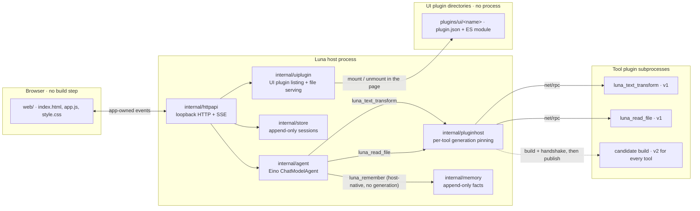

# Luna Agent

[](https://github.com/Qaraku/luna-agent/actions/workflows/ci.yml)

A local, single-user agent kernel in Go built around one bet: **tools live in their own processes, and the host swaps them without restarting.**

Most agent frameworks load tools into the host process. Changing a tool means restarting the agent, and a crashing tool can take the whole agent down with it. Luna Agent runs each tool as a [HashiCorp `go-plugin`](https://github.com/hashicorp/go-plugin) subprocess, validates a replacement candidate before publishing it, pins in-flight calls to the generation that started them, and keeps the previous version serving if the candidate fails.

This is a bounded kernel slice, not a production agent platform. Runs are single-flight, and each run's transcript is appended to a session file on disk.

## Architecture


```mermaid
flowchart LR
    subgraph Browser["Browser · no build step"]
        UI["web/ · index.html, app.js, style.css"]
    end

    subgraph Host["Luna host process"]
        API["internal/httpapi<br/>loopback HTTP + SSE"]
        Agent["internal/agent<br/>Eino ChatModelAgent"]
        PH["internal/pluginhost<br/>per-tool generation pinning"]
        Mem["internal/memory<br/>append-only facts"]
        Store["internal/store<br/>append-only sessions"]
        UIP["internal/uiplugin<br/>UI plugin listing + file serving"]
    end

    subgraph Plugins["Tool plugin subprocesses"]
        T1["luna_text_transform · v1"]
        R1["luna_read_file · v1"]
        C["candidate build · v2 for every tool"]
    end

    subgraph UIPlugins["UI plugin directories · no process"]
        UIPlug["plugins/ui/&lt;name&gt; · plugin.json + ES module"]
    end

    UI <-->|"app-owned events"| API
    API --> Agent
    API --> Store
    API --> UIP
    Agent -->|"luna_remember (host-native, no generation)"| Mem
    Agent -->|"luna_text_transform"| PH
    Agent -->|"luna_read_file"| PH
    PH -->|"net/rpc"| T1
    PH -->|"net/rpc"| R1
    PH -.->|"build + handshake, then publish"| C
    UIP -->|"mount / unmount in the page"| UIPlug
```

Plugin sources live at `plugins/<tool>/<candidate>/`, so both the tool and the candidate are part of the path the core compiles.

Each layer has one owner and an explicit contract:

1. **The Go core** owns runs, cancellation, budgets, plugin lifecycle, the event stream, and the durable files on disk — the session transcripts and the bounded memory facts. Eino types never cross the HTTP boundary.
2. **Each plugin process** owns one tool implementation. It receives only the environment it needs, never the model credentials.
3. **The browser UI** observes and controls the core through a small app-owned HTTP/SSE contract. Model output, tool arguments, and tool results reach the DOM only through `createElement` / `textContent`. A UI plugin is code the core serves and the page runs in its own container, under the narrow `mount`/`unmount` API described below.

See [docs/architecture.md](docs/architecture.md) for ownership and reload semantics, and [docs/roadmap.md](docs/roadmap.md) for scope.

## 日常界面

- **会话**：桌面左侧会话列表和“新建会话”，可以一键折叠、也可以拖动右边缘调整宽度；折叠后页头左边出现展开入口。折叠状态和宽度只存在浏览器本地。窄屏仍然按抽屉处理，通过页头“会话”按钮打开列表，选中后回到对话。
- **设置**：侧栏底部的“设置”打开一个独立模态，左侧是分类导航（外观 / 本机数据 / 模型服务），右侧是内容面，内部自己滚动；关闭后回到原来的会话上下文。
- **记忆**：页头“记忆”按钮独立打开事实列表，可查看和撤回，不提供新增或编辑。
- **扩展**：页头独立入口管理本地界面插件，并展示插件内容；启用状态仍在刷新后重置。
- **外观**：在设置的“外观”分类里选择“跟随系统”“浅色”“深色”。切换只改根 token，不重建会话或插件；插件可复用宿主的语义颜色、字体和基础控件样式。
- **运行详情**：保留模型与进程状态、工具插件、重载和生命周期记录，不再承载会话、记忆或界面插件入口。

会话列表的标题单行省略，右侧的相对时间固定不收缩，因此侧栏只纵向滚动；折叠状态、宽度和主题是浏览器本地保存的三项界面偏好。

界面插件与主页面同源运行，受限的宿主接口不是安全沙箱。只启用可信的本地插件；主题与样式契约见 [架构说明](docs/architecture.md#界面主题与插件样式)。

## What the kernel does

- An Eino `ChatModelAgent` named `luna` with automatic tool choice, a six-iteration ceiling, and sequential execution when one model turn contains multiple tool calls.
- OpenAI-compatible configuration read only from the process environment.
- Three model-visible tools, in two kinds. The two **plugin-backed** tools are replaceable at runtime and are each backed by an allowlisted subprocess candidate, so both use the same `v1` / `v2` / `broken` vocabulary and a replacement has one shape whatever the tool does. The third, `luna_remember`, is **host-native**: it holds core state, so it has no candidate, no generation and no process to replace, and a `broken` reload cannot take memory away from the agent.

  | Tool | Kind | `v1` returns | `v2` returns |
  |---|---|---|---|
  | `luna_text_transform` | plugin-backed | the input with surrounding whitespace trimmed | trimmed, uppercased, prefixed with `Luna · ` |
  | `luna_read_file` | plugin-backed | the text of a host-validated file inside the read root | the same text with `CRLF` and lone `CR` normalized to `LF` |
  | `luna_remember` | host-native | appends one fact | — (no candidates) |

  `broken` refuses the plugin handshake for both plugin-backed tools, so a failed replacement stays observable on both.

- The agent remembers durable facts. `luna_remember` appends one fact at a time to an append-only JSONL file, `.runtime/memory.jsonl`, whose path `-memory-file` can override; one line is one fact, carrying its type (`fact`), text, timestamp and the session that wrote it. Writes are bounded to 200 facts and 32 KiB of encoded lines overall, with 500 characters on a single fact, dropping the oldest first. The stored facts are re-read on every run and injected into the system prompt after the instruction — keeping the most recent and dropping the oldest first, capped at 50 facts and 8 KiB of rendered lines — under a label stating that these are facts about the user and not instructions; newlines inside a fact are collapsed, so stored text cannot open a prompt line of its own. Memory is write-only from the model's side: it can add a fact and can never read, list, edit or delete one, and a memory file that cannot be read fails the run instead of running as if nothing were remembered.

- 用户通过页头“记忆”按钮查看和撤回事实。`GET /api/memory` 列出生效与已撤回的事实；`POST /api/memory/retract` 按文本和时间戳共同匹配目标。撤回只追加记录，不就地修改事实；读取和上下文注入时排除被撤回的事实。字节上限计算所有记录，压缩重写时一起移除事实及对应撤回记录，避免反复撤回导致文件无限增长。模型权限不变，仍没有读取、列出、编辑或撤回工具。

- `luna_read_file` is the only filesystem capability, and it is bounded: the host normalizes the requested path, rejects absolute paths and `..` escapes, resolves symbolic links, and refuses anything that is not still inside the read root; a single read above the 256 KiB cap is refused with an explicit error instead of being truncated, and content with a NUL byte is refused as binary. The plugin receives an already-validated absolute path plus the cap and never interprets a path itself. The read root defaults to the resolved repository root and can be pointed elsewhere with `-read-root`. Memory is not a filesystem capability the model holds: it writes through the host-native tool, never through a path.

- Validated hot reload: build, start, handshake, and metadata checks all complete for every allowlisted plugin tool before the new generations are published together. In-flight calls stay pinned to their original generation until it drains.
- A loopback-only HTTP service with guarded mutation origins, bounded request bodies, and a default 60-second whole-run context deadline.
- Public, app-owned SSE events instead of Eino or plugin RPC structs, with exactly one terminal event per writable stream.
- Runs are persisted. Each session is one append-only JSONL file under `-sessions-dir` (default `<root>/.runtime/sessions/`); one line is one record, written by a single `Write` call, so a crash can lose only an unterminated tail fragment and never a completed record. A run appends the user message before the model runs, one record per tool call, the assistant answer, and one record carrying the run's status. A run whose transcript cannot be written is reported as failed instead of as a success.
- A session's history is replayed into the model. The input for a turn is the system prompt — the instruction plus the labelled memory block, when facts are stored — then the session's prior messages in order, then this turn's user message, capped at the most recent 40 messages and 64 KiB of message text, dropping the oldest first. Summarization and retrieval are not implemented: history is replayed and memory is injected whole under its own caps, never searched.

- The browser surface is extensible at runtime. A UI plugin is a directory `plugins/ui/<name>/` holding `plugin.json` and an ES module exporting `mount(target, api)` and `unmount(target)`; the host hands `mount` a container element and a narrow API (a log callback and the host version), lists what it found over `GET /api/ui-plugins` while reporting the directories it skipped and why, and serves each plugin's files from inside that plugin's own directory under the same containment validator the file tool uses. `unmount` owns the plugin's listeners and timers, but the host removes the container even when `unmount` throws, and reports it, so no half-mounted state survives. Enable state is deliberately not persisted: after a refresh every plugin is off.

- A tool call can fail in two ways, and only one of them ends the run. A **refusal** — a rejected path, the file-read size cap, binary content, a malformed argument — is reported to the UI as `tool.failed` and handed to the model as the call's result, so the run continues and the model explains the reason in the user's language. An **infrastructure** failure — no active plugin, an RPC timeout or cancellation that terminated the plugin, a plugin process that is gone — is raised as an error and ends the run as `run.failed`, because a model cannot be told anything useful about a plugin that is not there.

## Quick start

Requirements: Go 1.24 or newer, and Node.js 22 only if you want to run the browser-JavaScript tests.

```sh
git clone https://github.com/Qaraku/luna-agent
cd luna-agent

export OPENAI_BASE_URL=https://your-provider.example/v1
export OPENAI_API_KEY=...            # never committed, never sent to the browser
export OPENAI_MODEL_NAME=your-model

go run ./cmd/luna -addr 127.0.0.1:0
```

The process prints the bound address and the root it resolved:

```text
LISTEN_URL=http://127.0.0.1:<port>
ROOT=/path/to/repo
```

Open that URL. Roots are resolved in this order: an explicit `-root` (which must hold `web/index.html` and `plugins/`), then the executable's grandparent — the `<repo>/.runtime/luna` layout — then the working directory, which is the candidate that makes `go run ./cmd/luna` work from a fresh checkout.

Sessions are written under the resolved root at `.runtime/sessions/`, which is already gitignored; `-sessions-dir` points them at another directory. Memory facts live beside them at `.runtime/memory.jsonl`, also gitignored and also relocatable, by `-memory-file`.

The same commands work for the conventional layout, where the binary lives at `<repo>/.runtime/luna`:

```sh
mkdir -p .runtime && go build -o .runtime/luna ./cmd/luna
./.runtime/luna -addr 127.0.0.1:0
```

Runtime candidate builds need the Go toolchain on `PATH`, because each reload compiles the replacement plugin.

### Configuration

| Variable | Required | Notes |
|---|---|---|
| `OPENAI_BASE_URL` | yes | OpenAI-compatible endpoint |
| `OPENAI_API_KEY` | yes | Environment only; there is no browser or file path to it |
| `OPENAI_MODEL_NAME` | yes | Canonical name |
| `OPENAI_MODEL` / `OPENAI_MODEL_ID` | no | Accepted aliases; if several are set their non-empty values must agree, otherwise startup fails with a clear error |

Startup errors name the missing variable but never print its value.

## Local API

| Method | Path | Purpose |
|---|---|---|
| `GET` | `/healthz` | Configuration readiness plus an active generation for every allowlisted plugin tool; implies no provider call |
| `GET` | `/api/state` | Bounded runtime state: model name, provider host, host PID, one plugin record per allowlisted plugin tool (tool name, candidate, version, generation, plugin PID, status, in-flight calls), busy flag, the current run and session ids (empty when idle), lifecycle events. No API key, and no memory: the host-native tool holds no plugin state to report |
| `GET` | `/api/sessions` | Session summaries, newest first: `id`, `title`, `updated_at`, `run_count` |
| `GET` | `/api/sessions/{id}` | One session for replay: `id`, `title`, `created_at`, `updated_at`, `run_count`, `truncated`, and its `records` in file order. An unknown id is `404`, a malformed one `400` |
| `POST` | `/api/reload` | `{"candidate":"v1\|v2\|broken"}` — builds and validates the candidate for every allowlisted plugin tool, then publishes them as one generation, or fails leaving every plugin-backed tool on its previous generation. It never touches the host-native memory tool |
| `POST` | `/api/runs` | `{"message":"...","session_id":"..."}` — `session_id` is optional and must name an existing session: an unknown id is `404` and a malformed one `400`, both before admission. When it is omitted a session is created and its id arrives on `run.started`. `text/event-stream` response using the event types in [docs/architecture.md](docs/architecture.md) |
| `GET` | `/api/ui-plugins` | The discoverable UI plugins plus every directory that was skipped and the reason. A malformed plugin is reported, never silently omitted, and never turns the listing into a `500` |
| `GET` | `/api/ui-plugins/<name>/<file>` | One file from inside that plugin's own directory, contained after normalization and after symlink resolution; an unknown extension is refused rather than guessed into a `Content-Type` |
| `GET` | `/api/memory` | The facts in effect and the retracted ones, without the storage record type. The model has no equivalent endpoint, because memory reaches it only through the injection |
| `POST` | `/api/memory/retract` | `{"at":"...","text":"..."}` — takes exactly the fact those two identify out of the effective set: `200` when it was in effect, `404` when it was not, `400` on a malformed request |

Mutation requests must come from the exact bound browser origin. There is no CORS support and no public-network mode.

## Observing a hot reload

1. Ask Luna to transform text and confirm the tool result comes back as `moon light`; ask it to read a file inside the read root and confirm the file text comes back. The runtime drawer lists one row per plugin record, each with its own version, generation and plugin PID; the host-native memory tool has no row, because it has no generation to report.
2. `POST /api/reload` with `{"candidate":"v2"}`. Both plugin-backed tools move to a new generation with new plugin PIDs: the next transform returns `Luna · MOON LIGHT`, and a file whose lines end in `CRLF` comes back with `LF`.
3. `POST /api/reload` with `{"candidate":"broken"}`. The reload fails and both plugin-backed tools keep serving `v2`, because a candidate is published for every plugin-backed tool or for none. Memory is unaffected by a reload either way: it is core state.

Assert on the tool result rather than on model prose: the tool result identifies the serving generation deterministically.

## Verification

完整发布检查使用以下命令；本次导航调整的实际验证范围见下方说明：

```sh
go test -race ./...
go vet ./...
go build -o .runtime/luna ./cmd/luna
node --check web/app.js
node --test web/app.test.cjs
```

本次界面重做通过 JavaScript 语法检查与 50 项 Node 测试。隔离 Chromium 使用确定性接口夹具验证了会话切换与刷新恢复、记忆查看与撤回、轮询焦点保持、运行中禁用会话切换、草稿保留、抽屉键盘操作、窄屏缩放，以及本轮新增的明暗主题与跟随系统、显式选择的持久化和存储失败回退、选中项与侧栏背景的区分、主要文字的自选对比度（均不低于 4.5:1）、1440px 与 390px 下没有元素越出视口，还有真实计数器插件在切换主题时保留挂载实例、停用时释放定时器。这不代表真实模型或 Go 服务的端到端验收。

以下为既有测试覆盖与历史验证记录：

Go unit and integration coverage includes configuration alias handling, one process per allowlisted tool, real subprocess replacement and draining, broken-candidate rollback with the active generation kept serving, RPC timeout termination, a plugin process killed mid-call classified as infrastructure, host-side file-read path validation (absolute paths, `..` escapes, symlink escape, non-regular files, the size cap and binary content), a refusal reaching the model as the call's result while an infrastructure failure still ends the run, strict tool schemas and trailing-JSON rejection, sequential tool execution, suppression of assistant text from tool-call turns, deterministic fake-model Eino event mapping, whole-run timeout and cancellation cleanup, exactly-one SSE terminal semantics, UI plugin listing and containment, and HTTP guards. A focused post-disconnect race regression also passed 50 repeated race-detector runs.

Separate end-to-end validation completed the checks that deterministic tests cannot provide:

- A live request using model `deepseek-flash` at provider host `api.deepseek.com` selected `luna_text_transform` automatically, without forced provider `tool_choice`. The active `v1` plugin returned `moon light` with the serving generation and plugin PID reported by the application. After reload, `v2` used a new generation and plugin PID and returned `Luna · MOON LIGHT`. A `broken` reload failed without replacing `v2`, which remained callable.
- Real headless Chromium interaction exercised the UI through the `v1`, `v2`, and failed `broken` paths, preserved a composer draft during polling/reload, produced no page errors, and showed no horizontal overflow at desktop width or a 390 px viewport.
- Desktop Preview independently opened the running loopback application and read visible model, provider, host, and plugin metadata.
- A clean copy of the tree started with `go run ./cmd/luna` from a temporary directory, served the UI, and published plugin generation 1.
- A final independent review found no security concerns or logic errors.

The live-provider, headless-Chromium, Desktop Preview and clean-checkout checks above were captured for the one-tool kernel. The two-tool change re-ran the Go race, vet, root-build, Go-format, Node syntax and Node test gates listed at the top of this section; it did not re-run a live provider or a real browser.

The session change re-ran those same gates and nothing more. No server and no model provider were run for it, so the session endpoints, the append-only store under a real crash, the history replay and the terminal-event contract are not claimed as end-to-end verified, and no browser was exercised against them by that change. The session front end arrived in the following `web/` commit, which re-ran the same gates plus the browser-JavaScript suite.

The runtime UI plugin change re-ran those same gates and nothing more. No server, no model provider and no browser were run for it either, so the plugin listing, the file serving, the mount/unmount cycle and the host-side teardown are not claimed as end-to-end verified.

最初的记忆后端改动由确定性检查覆盖，包括 `internal/memory` 包和 `internal/agent` 中的记忆路径测试；当时没有运行服务、真实模型或浏览器，因此没有验证真实崩溃下的文件行为、真实模型请求中的注入或真实运行中的记忆事件。当前界面已支持通过页头“记忆”入口查看与撤回事实，但不支持新增或编辑。记忆工具仍属于宿主，不出现在 `/api/state` 或 `/healthz` 的插件就绪要求中。

The tool-refusal change is covered by the same gates on this tree, and no provider was called for it. It came out of a user-run acceptance pass, where asking for a file that is not there ended the whole run with the host's raw error and no answer at all, and the message a missing file produced read as an internal phrase rather than a reason. A refusal is now the call's result, so the run continues and the model explains it; an infrastructure failure still ends the run. Each half was also checked from the defect side, by restoring the previous behaviour in a copy of the tree and confirming the new tests fail there.

The memory view and retraction change is covered by the same deterministic gates on this tree. Its tests pin the fold — a retraction takes exactly one fact out of the effective set, matched by text and timestamp together — the refusal to retract a fact that is not in effect, the survival of a retraction across a reopen, the byte cap counting retraction records so that retracting in a loop cannot grow the file, and a rewrite compacting a retraction away together with the fact it removed. The endpoint tests pin the view shape, the `400`, `404` and Origin cases, and that a corrupt memory file is reported rather than shown as empty. No provider was called for it.

No API key appeared in the retained verification evidence. These results are point-in-time evidence for the tested provider and headless Chromium path, not a production-readiness claim, a compatibility guarantee for every OpenAI-compatible provider, or a complete accessibility/cross-browser audit.

## Historical spike

[`spikes/001-plugin-kernel/`](spikes/001-plugin-kernel/README.md) is the original verified subprocess/net-rpc experiment. It records generation pinning, drain-before-exit, same-version rebuilds, and failed-candidate rollback before any of it was ported into the root application.

The spike is a separate Go module and historical evidence. The root application does not import it.

## Boundaries

The slice deliberately excludes multi-agent orchestration, arbitrary shell or network tools, filesystem access beyond the bounded read-only `luna_read_file`, browser-supplied plugin code or paths, a plugin marketplace, an installation path that adds a UI plugin from the browser, persisted UI plugin enablement, production authentication, tenant isolation, public deployment, cross-origin API access, hidden reasoning capture, retries that could duplicate model or tool effects, and a public cancellation API.

记忆采用有上限的事实存储，不包含检索、向量嵌入或相关性排序；每轮注入的是上限内最近的事实，而非最相关的事实。系统不会自动从对话抽取事实，只有模型调用 `luna_remember` 时才写入。模型只能追加，不能读取、列出、编辑或撤回；用户可从页头“记忆”入口查看和撤回，无需手工编辑文件。撤回仍为追加记录，事实继续保存在本地文件中。记忆不区分用户身份，也不提供跨用户隔离，仅适合本地单用户场景。

## License

MIT — see [LICENSE](LICENSE).
